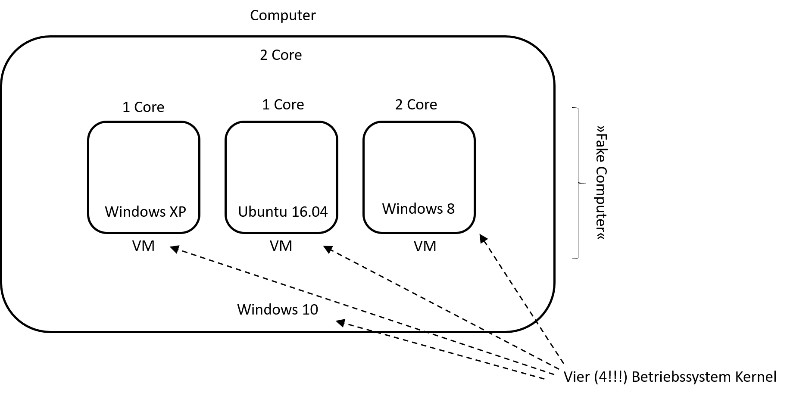
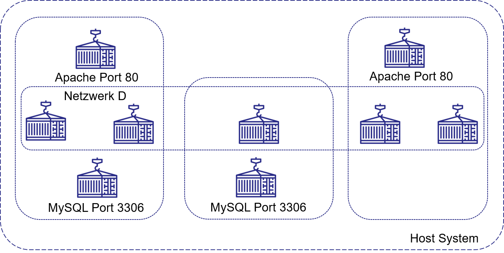
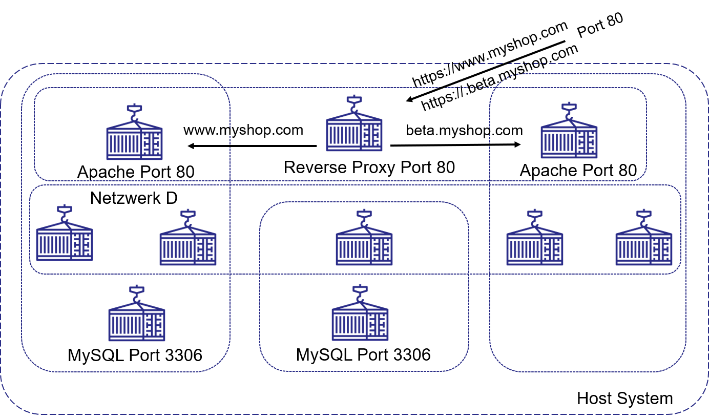

<!--

author:   Andreas Heil

email:    andreas.heil@hs-heilbronn.de

version:  0.3

language: de

narrator: DE German Male

tags: devops, lecture

comment:  

-->


[](https://LiaScript.github.io/course/?https://github.com/aheil/devops) 

# DevOps

Dieses Repository ist Teil des Bachelor Studiengangs Software Engineering (SEB) an der Hochschule Heilbronn.

 Diese Seiten sind als [interaktiver Kurs verfügbar](https://liascript.github.io/course/?https://github.com/aheil/devops) verfügbar.

Die Veranstaltung basiert u.a. auf dem Buch *Das DevOps Handbuch* von Gene Kim at al. Die Veranstaltung vermittelt das Mindset der DevOps-Philosophie und führt in eine Reihe von Techniken und Technologien entlang eines typischen DevOps-Zyklus ein. Hier finden immer wieder aktuelle Technologien und Tools in der Veranstaltung Einzug. Der Kurs baut auf Veranstaltungen aus dem 2. und 3. Semester auf.

Programmierkenntnisse als auch ein sicherer Umgang mit Git bzw. GitLab wird vorausgesetzt. Der erfolgreiche Abschluss der Veranstaltung Developer Tools im Software Engineering (262051) ist daher empfohlen. Grundlagen in der Erstellung von Skripten sollten bereits in der Vorlesung Betriebssysteme (262007) erworben worden sein. Die erfolgreiche Teilnahme an Grundlagen verteilter Systeme (262055) und Software Engineering komplexer Systeme (262061) ist ebenfalls empfohlen, da zahlreiche Konzepte der darin behandelten Themen aufgegriffen werden.

In Gruppenarbeit werden praktische Aufgabenstellungen erarbeitet, deren erfolgreiche Bearbeitung Voraussetzung zum Bestehen des Kurses ist.

Es werden vorlesungsbegleitend 1-2 Tests geschrieben, die zum Bestehen des Kurses erfolgreich bestanden werden müssen.

Der Inhalt der Veranstaltung kann aufgrund der Weiterentwicklung der Technologien von Semester zu Semester leicht variieren.

Für Studierende der Hochschule Heilbronn steht ein [ILIAS Raum](https://ilias.hs-heilbronn.de/goto.php?target=crs_262954&client_id=iliashhn) für den Kurs mit Forum und der Möglichkeit zur Abgabe der Übungsaufgaben bereit.

## Zeitplan 

| Einheit # | Datum | Thema |
|---|---|---|
| 0 | | [Einführung und Motivation](https://liascript.github.io/course/?https://raw.githubusercontent.com/aheil/devops/master/lectures/01_einfuehrung.md#1) |
| 1 | | [ Container ](https://liascript.github.io/course/?https://raw.githubusercontent.com/aheil/devops/master/lectures/02_container.md#1)|

<!---
|  - | 03.10.2022 | Vorlesungsfrei (Tag d. deutschen Einheit) |
|  1 | 10.10.2022 | Besprechung der Verstänndnissfragen |
|  2 | 17.10.2022 | Docker Einführung | Docker Aufgabe 1 + 2 |
|  3 | 24.10.2022 | Entfällt (Blockveranstaltung SEM) |
|  4 | 31.10.2022 |  |
|  5 | 07.11.2022 | Kanban und Pull-Workshop |
|  6 | 14.11.2022 | Value Stream Maps |
|  7 | 21.11.2022 | N.N. |
|  8 | 28.11.2022 | Entfällt (Blockwoche SEB) |
|  9 | 05.12.2022 | Besprechung der Docker Hausaufgaben |
| 10 | 12.12.2022 | N.N. |
| 11 | 19.12.2022 | N.N. |
|  - | 26.12.2022 | Vorlesungsfrei |
|  - | 02.01.2023 | Vorlesungsfrei |
| 12 | 09.01.2023 | N.N. |
| 13 | 17.01.2023 | N.N. | 
-->

[Screencasts Teil 1-5](https://youtube.com/playlist?list=PLBXz7ZC5wx7jL3kXRIkdOT9Jh7CbdjXqJ)
## Kursübersicht 

Dieser Kurs ist ein Grundlagenkurs im Bachelor Studiengang Software Engineering Bachelor (262062).

**Dozent**

Prof. Andreas Heil

**Kursnummer**

262062 (SPO4)

**Level**

Hauptstudium Bachelor (SEB)

**Semesterwochenstunden/ECTS**

2/3

**Kurszeiten**

- 1 Vorlesungseinheit/Woche
- 90 Min./Einheit
- Die genauen Veranstaltungszeiten entnehmen Sie bitte dem aktuellen [Stundenplan](https://splan.hs-heilbronn.de/). 

**Workload**

- 30h Kontaktstunden/Lerneinheiten
- 90h Selbststudium

**Lizenz**

Sofern nicht anders angegeben, steht das gesamte Kursmaterial unter einer [Creative Commons Namensnennung 4.0 International Lizenz](https://creativecommons.org/licenses/by/4.0/). 

<!--- 
# Vorlesungsmaterial 


### Container

#### Idee hinter Containern

Intuitives Vorgehen

* Alle Dienste, Server-Komponenten und Datenbanken auf einem Server/Rechner installieren 
* Vorteil: Einfach Installation, einfache Kommunikation unter den Diensten
* Nachteil: Über die Zeit immer schwerer wartbar 

Fortgeschrittenes Modell 

* Dienste, Server-Komponenten und Datenbanken auf unterschiedlichen Servern (insb. virtuellen Maschinen), z.B.

  * VM für Web Server
  * VM für Datenbank 
  * VM für Monitoring
  * Vorteil: Unabhängig
  * Nachteile
  * Wartung vieler (virtueller) Maschinen, i.d.R. durch Betriebsteam
  * Ressourcenverbrauch 

Container Modell

* Dienste, Server-Komponenten und Datenbanken werden in kleinen, isolierten Containern betrieben, z.B.
* Container für Front-End 
* Je ein Container pro Service
* Je ein Container pro Datenbank 

* Vorteile

  * Leichtgewichtig
  * Unabhängig 
  * Konfigurierbar 

* Nachteile

    * Managementaufwand: Stichwort Kubernetes 

#### Virtuelle Maschinen (VMs) auf einem Rechner



#### Container auf einem Rechner


#### Wie wird das erreicht?

* Private Sichten (=Container) bilden isolierte User-Space-Instanzen für verschiedene Anwendungen
* Hardware-Virtualisierung, Isolation und API (Betriebssystem-Kernel, vgl. Betriebssysteme SEB2) werden kontrolliert
* Keine Virtualisierung des Betriebssystems, sondern eine Art der »User-Space-Virtualisierung«

[Julia Evans](https://twitter.com/b0rk) liefert hierfür eine wunderbare Illustration in Form eines "Zines": 


(Used with pending permissions.)

#### Beispiel einer Software in Containern


##### Automatisierung mit Containern

* Mit Container-Technologie lässt sich sehr viel (alles) automatisieren
* Stichwort: GitLab CI/CD (später mehr dazu) 
* Stichwort: Infrastructure as Code (IaS)
* Werkzeuge: Ansible, Salt, Puppet, Vagrant, GitLab CI/CD, GitHub Actions... 

---

#### Container können...

* Unabhängig voneinander gewartet und aktualisiert werden 
* Können in unterschiedlichen Versionen betrieben werden
* Beeinflussen sich nicht gegenseitig

#### Container 101

* Container enthalten eine Software und alle Abhängigkeiten
* Gestartet wird ein Container aus einem Abbild (engl. image)
* Container verhalten sich auf allen Maschinen gleich (Entwickler-Maschine, Server, Cloud-Anbieter,...)
* Für die Software sieht der Container aus wie eine eigene Maschine
* Die Software weiß nicht, dass sie in einem Container steckt
* Wird ein Container gelöscht, werden keine Konfigurationsreste auf dem Host / dem Betriebssystem hinterlassen
* Daumenregel: Ein Dienst pro Container 

#### Beispiel Microservices


Alles auf einer Maschine oder jeder Dienst in einem eigenen Container?

#### Beispiel Container-Umgebung


#### Container und Netzwerke


Container können über eigene Netzwerke miteinander kommunizieren

#### Nutzung von Standard-Ports in Containern




#### Reverse Proxy 



Löst dabei so manche Probleme einzelner Maschinen...

#### Docker Compose 

* Management mehrerer Container

* Docker installieren (Linux, Windows, macOS)

  * Variante 1: Fertiges Image laden und Container starten

```bash
version: '3'
services:  my_db:
    image: postgres:9-alpine
    environment:
      POSTGRES_DB: mydb
      POSTGRES_PASSWORD: topsecret
      POSTGRES_USER: user1
volumes:
  - db-data:/var/lib/postgresql/data
restart: always
networks:
  - my_network
```

* Eine Konfigurationsdatei: `docker-compose.yml`
* Container werden mit `docker-compose up` gestartet 
* Container werden mit `docker-compose down` gestopppt


#### Vorsicht bei fertigen Images 


* Am Beispiel des *postgres*-Images
* Was steckt in dem Image?
* Wirklich nur die Datenbank? 
* Vielleicht ein BitCoin Miner?
* Vielleicht ein SpamBot?
* Vielleicht ein Skript das alles DB-Einträge an jemanden übermittelt?
…
⚠ Geschichten aus dem wahren Leben...


#### Wie bekommt man Software in einen Container?

* Docker installieren (Linux, Windows, macOS)

    * Variante 2: Eigenes Image »bauen«, Container starten 

```bash 
FROM alpine
RUN apk --no-cache add inotify-tools jq openssl util-linux bash
COPY dumpcerts.sh /dumpcerts.sh
RUN chmod +x /dumpcerts.sh
COPY entrypoint.sh /entrypoint.sh
ENTRYPOINT [ "/entrypoint.sh" ]
```
* In einem File, z.B. `Dockerfile`

👨‍🏫 Praxisbeispiele

#### Hausaufgaben 

1. Übungsaufgabe durcharbeiten (Step-by-Step): https://github.com/aheil/hhn-devops/blob/main/labs/02_container/docker_basics.md

2. Abgabe: https://github.com/aheil/hhn-devops/blob/main/labs/02_container/docker_container.md 

#### Referenzen 

[1] c't wissen Docker DOCKER – Komplexe Software einfach einrichten, Heise Medien GmbH, 2019

[2] Offizielle Docker Dokumentation: https://docs.docker.com/ 


## Kanban

### Lernziele

* Grundlegende Konzepte hinter Kanban **kennen lernen**
* Unterschiede (Vor- und Nachteile) gegenüber anderen agilen Ansätzen **verstehen**
* **Verstehen** wann Kanban vorzugsweise eingesetzt werden kann 

### Inhalt 

* Kanban Einführung 
* Kanban Board 
* Work in Progress 
* Praxis Tipps
* Praxisübung

### Kanban Ursprung

* Jap. *kan* 看 (sichtbar) und *ban*  板 (Karte o.d Brett)
* Konzepte entstammen dem Toyota Production System (TSP)
* Konkret: Just-in-Time Scheduling System

  * Nur »machen« was benötigt wird 
  * Nur »machen« wenn es benötigt wird 
  * Nur »machen« wieviel benötigt wird

Kanban System wurde sowohl für die Produktion als die Software Entwicklung adaptiert. 

### Toyota Kanban

> The kanban, a tool that describes **which and how many parts are used where and when, made just-in-time production possible**. The new kanban management system was adopted at all plants in 1963. By producing parts in accordance with the instructions on the kanban, **parts are delivered among the different plants only in the volumes needed, and inventories within each process can be eliminated**. As kanban came into widespread use, problems such as standardization of work and transport management were resolved one after another and production lines operated smoothly.[^1]

### Drei Prinzipien

* Visualize
* Limit Work in Progress
* Manage Flow

### Visualisieren - Kanban Board

* Information Fridge

  * Muss immer wieder geöffnet werden, um nachzuschauen ob „etwas Neues drin ist“
  * Klassische Ticket-Systeme, digitale Boards etc.

* Information Radiator

  * Große sichtbare Displays
  * Für das eigene Team und alle Interessierten
  * Aktualisierungen möglichst einfach halten
  * So groß wie möglich!!! 
  * »Use it or lose it!« 

### Kanban Board Beispiel

[1]


### Kanban Board - Tipps

* Große Boards verwenden (s. Information Radiator)
* Digitale und physische Boards haben beide Vor- und Nachteile 
* Bei ungeübten Teams möglichst physische Boards nutzen
* Regelmäßige Stand-Ups (Daily Stand-Up)
* Den Workflow anpassen, das Board reflektiert den aktuellen Workflow im Team
* Der Workflow kommt nicht vom Management, sondern vom Team 
* Nicht zu viele Gedanken machen, Änderungen willkommen heißen 

### Kanban Board - Beispielaufbau


### Enter & Exit Critera


### Priorisierung

* Anders als in Scrum: 

  * Priorisierung kann fortwährend erfolgen 
  * Täglich, u.U. auch wöchentlich oder zwei-wöchentlich

* Reihenfolge der Tickets am Board spiegelt die Priorität wieder 

  * Es wird immer das am höchsten priorisierte Ticket gezogen
  * No-Go: Ticket ziehen, das einem am meisten Spaß macht 


### Work in Progress (WiP)

* Beinhaltet alle begonnen aber noch nicht abgeschlossenen Aufgaben

  * Auch alle Aufgaben, an denen gerade nicht gearbeitet wird
  * Auch alle Aufgaben, für die gerade auf Zuarbeit geartet wird 

* Abk.: WiP 
* WiP-Limit

  * Anzahl an gerade in Bearbeitung befindlicher Aufgaben limitieren
  * Anzahl der Tickets 
  * Typischerweise pro Spalte (in Bearbeitung, Test, Abnahme etc.) 

### Little's Law

* Ursprung: John D.C. Little 

  * In den 1950ern einfach angenommen
  * Erst Ende der 1960er bewiesen 

* Bedeutung: Je mehr gleichzeitig bearbeitet wird, desto länger dauert die Fertigstellung aller »Work Items«


---

### Auswirkung von Parallelität


### WiP-Limit


### WiP-Limit Wisdoms

* Es gibt keine »goldene Regel«
* Beobachten und anpassen
* Guter Ansatz: »Stop starting, start finishing « 
* Beispiel 1: Um Pairing zu forcieren kann ein WiP-Limit von $Teamgröße -1$ gewählt werden 
* Beispiel 2: Existieren z.B. externe Abhängigkeiten (=Wartezeiten) kann ein WiP-Limit von $Teamgröße \cdot 2$ gewählt werden um Wartezeiten (engl. idle time) zu vermeiden
* Beispiel 3: … 

### Praxis Tipps 

* Durchsatz erhöhen
* Verschwendung (jap. *muda* 無駄) z.B. durch Wartezeiten oder Blocker vermeiden 
* Probleme schnell lösen 
* Kanban ermöglicht häufig Priorisierung (signifikanter Unterschied zu Scrum) 
* Geeignet für kleine und bekannte Arbeitseinheiten (z.B. im Ops-Umfeld) 
* Schlechter für Entwicklung, da Aufgaben geschätzt werden müssen 
* WiP-Limits einhalten

### Referenzen

[^1]: https://www.toyota-global.com/company/history_of_toyota/75years/text/entering_the_automotive_business/chapter1/section4/item4.html

---

### Bildquellen

[1] Rakuten Inc.,  https://commons.wikimedia.org/wiki/File:Lean_Kanban.jpg, CC BY-SA 3.0 (https://creativecommons.org/licenses/by-sa/3.0)

## Übungsaufgaben und Abgaben

|Aufgabe|Thema|Gewichtung (in %)|
|---|---|---|
| [Artikel Kasteleiner und Schwartz - Einführung in DevOps](#aufgabe-1-verstandnisfragen) |Einführung|5|
|Docker Web Server|Container-Technologien|10|
|Docker CI/CD Image|Container-Technologien|15|
|Ansible Playbook|Automatisierung|20|
|Vagrant|Automatisierung|20|
|Test|Vorlesungsbegleitend|30|

Der Test wird in einer regulären Vorlesungseinheit durchgeführt und wird mindestens zwei Wochen vorher angekündigt.  

Relevant sind alle Themen, die bis zum Test in der Veranstaltung behandelt wurden.  

Das Bestehen des Tests ist Voraussetzung um den Kurs in Gänze zu bestehen.
Während des Prüfungszeitraums wird die Möglichkeit angeboten den Test zu wiederholen.

### Aufgabe 1: Verstandnisfragen

* Lesen Sie den Artikel von Kasteleiner und Schwartz: DevOps aus der Informatik Spektrum 42.
* Sie können Artikel direkt bei Springer abrufen: [https://doi.org/10.1007/s00287-019-01173-2](https://link.springer.com/article/10.1007/s00287-019-01173-2)  
* Notieren Sie drei Fragen bzw. offene Punkte, die sich durch das Studium des Artikels ergeben.  
* Notieren Sie die Fragen in einer Datei und geben Sie diese als Gruppenabgabe in ILIAS ab.
* Die Fragen werden in der folgenden Einheit besprochen.

## Screencasts

Screencasts zur Veranstaltung sind unter [https://www.youtube.com/playlist?list=PLBXz7ZC5wx7jL3kXRIkdOT9Jh7CbdjXqJ](https://www.youtube.com/playlist?list=PLBXz7ZC5wx7jL3kXRIkdOT9Jh7CbdjXqJ) zu finden. 

<iframe width="560" height="315" src="https://www.youtube-nocookie.com/embed/videoseries?list=PLBXz7ZC5wx7jL3kXRIkdOT9Jh7CbdjXqJ" title="YouTube video player" frameborder="0" allow="accelerometer; autoplay; clipboard-write; encrypted-media; gyroscope; picture-in-picture" allowfullscreen></iframe>

## Literatur

**Das DevOps-Handbuch  **

Das Standardbuch, das vorrangig die philosophischen Grundlagen hinter DevOps zusammenfasst und die Ursprünge von DevOps beschreibt. 

Insbesondere die zahlreichen Referenzen (die man sich unbedingt anschauen und durchlesen sollte) machen die Lektüre lesenswert.


Das DevOps Handbuch<br />
Erscheinungsdatum: 09.08.2017<br />
O´Reilly<br />
ISBN: 978-3-96009-047-2

Das Buch ist für Student:innen der HHN über die LIV als eBook, in der Bibliothek am Standort Sontheim als auch meinem Semesterapparat verfügbar. 

**Projekt Phoenix**

Der Roman zur Vorlesung. Hierbei handelt es sich um das, in der ersten Veranstaltung referenzierte Buch, aus dem die Beispiele stammen. 


Projekt Phoenix<br />
Erscheinungsdatum: 30.09.2015<br />
O'Reilly<br />
ISBN: 978-3-95875-175-0

Für die Veranstaltung ist es nicht notwendig das Buch (es ist ein Roman) zu lesen, um die Probleme in der IT und Lösungsmöglichkeiten auf Basis von DevOps zu verstehen, wird die Lektüre aber auf jeden Fall empfohlen. Die kommenden Semesterferien bieten sich hierfür ideal an. 

## Weiterführendes Material 

### Serverless

Serverless bedeutet nicht, das wir keine Server mehr haben. Am besten lässt sich Serverless mit einem Zitat von Scott Hanselmann erklären: 

> Serverless does not mean we have no server, it simply means let's think less about servers.

- [Probleme beim Serverless-Kult](https://dev.to/brentmitchell/after-5-years-im-out-of-the-serverless-compute-cult-3f6d)

## Referenzen

[]

-->
