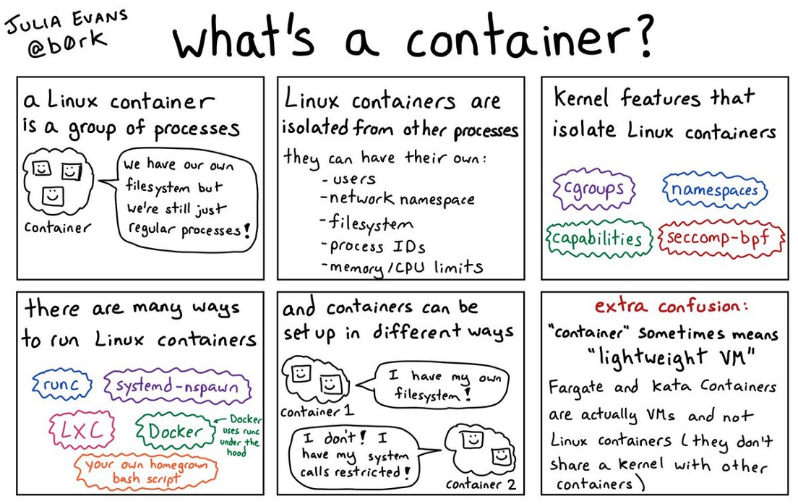

<!--

author:   Andreas Heil
email:    andreas.heil@hs-heilbronn.de
version:  0.2
language: de
narrator: DE German Male

comment:  

-->


[](https://LiaScript.github.io/course/?https://github.com/aheil/devops) 

# DevOps

Dieser Kurs ist Teil des Bachelor Studiengangs Software Engineering (SEB) an der Hochschule Heilbronn.

Dies ist das Repository der Kursinformationen. Diese Seiten sind als [interaktiver Kurs verfügbar](https://liascript.github.io/course/?https://github.com/aheil/devops) verfügbar.

Die Veranstaltung basiert u.a. auf dem Buch *Das DevOps Handbuch* von Gene Kim at al. Die Veranstaltung vermittelt das Mindset der DevOps-Philosophie und führt in eine Reihe von Techniken und Technologien entlang eines typischen DevOps-Zyklus ein. Hier finden immer wieder aktuelle Technologien und Tools in der Veranstaltung Einzug. Der Kurs baut auf Veranstaltungen aus dem 2. und 3. Semester auf.

Programmierkenntnisse als auch ein sicherer Umgang mit Git bzw. GitLab wird vorausgesetzt. Der erfolgreiche Abschluss der Veranstaltung Developer Tools im Software Engineering (262051) ist daher empfohlen. Grundlagen in der Erstellung von Skripten sollten bereits in der Vorlesung Betriebssysteme (262007) erworben worden sein. Die erfolgreiche Teilnahme an Grundlagen verteilter Systeme (262055) und Software Engineering komplexer Systeme (262061) ist ebenfalls empfohlen, da zahlreiche Konzepte der darin behandelten Themen aufgegriffen werden.

In Gruppenarbeit werden praktische Aufgabenstellungen erarbeitet, deren erfolgreiche Bearbeitung Voraussetzung zum Bestehen des Kurses ist.

Es werden vorlesungsbegleitend Tests geschrieben, die zum Bestehen des Kurses erfolgreich bestanden werden müssen.

Der Inhalt der Veranstaltung kann aufgrund der Weiterentwicklung der Technologien von Semester zu Semester leicht variieren.

Für Studierende der Hochschule Heilbronn steht ein [ILIAS Raum](https://ilias.hs-heilbronn.de/goto.php?target=crs_262954&client_id=iliashhn) für den Kurs mit Forum und der Möglichkeit zur Abgabe der Übungsaufgaben bereit.

## Kursübersicht 

Dieser Kurs ist ein Grundlagenkurs im Bachelor Studiengang Software Engineering Bachelor (262062).

**Dozent**

Prof. Andreas Heil

**Kursnummer**

262062 (SPO4)

**Level**

Hauptstudium Bachelor (SEB)

**Semesterwochenstunden/ECTS**

2/3

**Kurszeiten**

- 1 Vorlesungseinheit/Woche
- 90 Min./Einheit
- Die genauen Veranstaltungszeiten entnehmen Sie bitte dem aktuellen [Stundenplan](https://splan.hs-heilbronn.de/). 

**Workload**

- 30h Kontaktstunden/Lerneinheiten
- 90h Selbststudium

**Lizenz**

Sofern nicht anders angegeben, steht das gesamte Kursmaterial unter einer [Creative Commons Namensnennung 4.0 International Lizenz](https://creativecommons.org/licenses/by/4.0/). 

## Kalender 


| Einheit # | Datum | Thema | Hausaufgaben | 
| --- | --- | --- |
|  0 | 26.09.2022 | Begrüßung / Einführung | [Artikel Kasteleiner und Schwartz - Einführung in DevOps](#aufgabe-1-verstandnisfragen) | 
|  - | 03.10.2022 | Vorlesungsfrei (Tag d. deutschen Einheit) | |
|  1 | 10.10.2022 | Besprechung der Verständnisfragen | [Screencasts Teil 1-5](https://youtube.com/playlist?list=PLBXz7ZC5wx7jL3kXRIkdOT9Jh7CbdjXqJ) | 
|  2 | 17.10.2022 | Docker Einführung | Docker Aufgabe 1 + 2 |
|  3 | 24.10.2022 | Entfällt (Blockveranstaltung SEM) | |
|  4 | 31.10.2022 | Besprechung der Docker Hausaufgaben | |
|  5 | 07.11.2022 | N.N. | |
|  6 | 14.11.2022 | N.N. | |
|  7 | 21.11.2022 | N.N. | |
|  8 | 28.11.2022 | Entfällt (Blockwoche SEB) | |
|  9 | 05.12.2022 | N.N. | |
| 10 | 12.12.2022 | N.N. | |
| 11 | 19.12.2022 | N.N. | |
|  - | 26.12.2022 | Vorlesungsfrei | |
|  - | 02.01.2023 | Vorlesungsfrei | |
| 12 | 09.01.2023 | N.N. |
| 13 | 17.01.2023 | N.N. | 

## Vorlesungsmaterial 

### Einführung und Überblick 

#### Ziele und Kompetenzen 

Am Ende dieser Einheit sollen Sie 

- grundlegende Probleme der herkömmlichen Entwicklungs- und Betriebsorganisation kennen lernen, 
- verstehen was mit DevOps erreicht werden soll und 
- einige Möglichkeiten kennen lernen, wie diese Ziele erreicht werden können. 

#### Projekt Phoenix 

Die folgenden Beispiele entstammen dem Buch "Projekt Phoenix".

<!-- style="width: 30%;" -->

Projekt Phoenix<br />
Gene Kim, Kevin Behr & George Spafford<br />
Deutsche Ausgabe<br />
O’Reilly, 2015<br />
ISBN 978-3958751750<br />

#### „Projekt Phoenix“ - Ausgangslage

> Bill Palmer ist IT-Manager bei Parts Unlimited. An einem Dienstag morgen erhält er auf der Fahrt zur Arbeit einen Anruf seines CEO. Die neue IT-Initiative der Firma mit dem Codenamen Projekt Phoenix ist entscheidend für die Zukunft von Parts Unlimited, aber das Projekt hat Budget und Zeitplan massiv überzogen. Der CEO will, dass Bill direkt an ihn berichtet und das ganze Chaos in neunzig Tagen aufräumt, denn sonst wird Bills gesamte Abteilung outgesourct.

#### „Projekt Phoenix“ – Fail #1

Die Gehaltssoftware spuckt bei einem signifikanten Teil der Mitarbeiter nur Hieroglyphen aus, anstatt das tatsächliche Gehalt zu berechnen.

Gehälter drohen, nicht ausgezahlt zu werden. Der Betriebsrat würde Alarm schlagen und die Presse negative Schlagzeilen zu Parts Unlimited schreiben.

#### „Projekt Phoenix“ – Fail #2

Weil sich unterschiedliche Teams nicht abgestimmt haben, dauert der Rollout einer Kassensoftware viel zu lange. Die Datenbank-Migration dauert nicht nur Stunden, sondern Tage.

Doof, dass die Kassen am nächsten Tag wieder öffnen und ohne Software nicht arbeiten können. Filialen nehmen die Kreditkartendaten der Kunden entgegen und schreiben sie auf, was aber ein Sicherheitsverstoß ist...

#### Zitate aus „Projekt Phoenix“ (1)

- Über die Zusammenarbeit von Development und Operations

> „Es ist erstaunlich, wie die Übergaben zwischen Entwicklung und IT Operations jedes Mal in die Hose gehen. Aber angesichts des dauerhaften Kleinkriegs zwischen den beiden Gruppen sollte ich nicht überrascht sein.“

#### Zitate aus „Projekt Phoenix“ (2)

- Über Brent, dem Alleskönner, von dem alles abhängt

> „Ich sage ja nicht, dass Brent das absichtlich macht, aber ich frage mich, ob Brent sein Wissen als eine Art Superheldenkraft sieht. Vielleicht will ein Teil von ihm das gar nicht aufgeben. Er hat damit eine Stellung inne, von der ihn niemand vertreiben kann.“ „Vielleicht, vielleicht auch nicht“, sage ich. „Aber ich werde euch erzählen, was ich sicher weiß: Jedes Mal, wenn wir Brent etwas fixen lassen, das keiner von uns wiederholen kann, wird Brent ein bisschen klüger und das gesamte System ein bisschen dümmer. Wir müssen dem ein Ende bereiten.“

#### Zitate aus „Projekt Phoenix“ (3)

- Über erfolgreiche Teams

> Ein großartiges Team bedeutet nicht, dass es nur aus den klügsten Köpfen besteht. Ein Team wird dann gut sein, wenn sich alle vertrauen können. Es entsteht viel Power, wenn diese Magie zwischen den Leuten existiert.

#### Zitate aus „Projekt Phoenix“ (4)

- Über die Zeit, in der ein neues Produkt auf dem Markt sein muss (Time-to-Market)

> Produkte müssen in sechs Monaten auf dem Markt sein. Höchstens in neun. Ansonsten schnappt sich eine chinesische Firma unsere Idee, bringt sie in die Läden unserer Konkurrenz und bekommt damit einen großen Marktanteil. In diesen Zeiten starker Konkurrenz muss man schnell im Markt sein und auch die Fehler schnell machen. Wir können uns keine mehrjährigen Entwicklungszyklen mehr leisten und erst am Ende erkennen, ob das Produkt gut ist oder beim Kunden durchfällt. Es müssen kurze und schnelle Zyklen sein, in denen das Feedback aus dem Markt fortlaufend einfließt.

#### DevOps: Definition

- Kunstwort aus engl. »Development« = Entwicklung und »Operations« = Betrieb
- DevOps klingt wesentlich cooler als »EntBet«
- DevOps beschreibt eine Form der Zusammenarbeit, bei der *Entwicklung und Betrieb* einer Software als *untrennbare Einheit* angesehen werden
Mittlerweile auch Abwandlungen davon, z. B. *DevSecOps*, wo der Security-Aspekt explizit erwähnt wird (Berücksichtigung von Sicherheitslücken in einer Software und Umgebung)

#### Was gehört alles dazu?

<!-- style="width: 95%;" -->

#### Wie wurde früher*) Software entwickelt?

<!-- style="width: 95%;" -->

*) häufig ist dies auch heute noch der Fall

#### Kommunikationswege *)

<!-- style="width: 95%;" -->

*) Sie haben sicherlich gedacht, Sie benötigen das ganze Zeug aus der Vorlesung aus dem vergangenen Semester nicht mehr... 

#### Der ewige Interessenskonflikt

<!-- style="width: 95%;" -->
[Bildquelle Bildquelle: https://imgflip.com/](Bildquelle: https://imgflip.com/)

- Es werden dringliche Zuarbeiten von anderen Teams oder Abteilungen benötigt
- Es werden Tickets erzeugt
- Wartezeiten entstehen

Mehr zum Thema Verschwendung im Screencast:

!?[Screencast zum Thema Verschwendung](https://youtu.be/EY78vVaA95E)<!-- style="width: 45%; height: 45%;" -->

#### Wie könnte dieser Konflikt gelöst werden?

Kleiner Tipp aus SEKS: Warum war Canon in den 1970ern mit der Canon AE-1 gleich nochmal so erfolgreich?*)

*) Schon wieder etwas aus der alten Vorlesung…

#### Lösung: Cross-funktionale Teams

- Ein *gemeinsames* Produktteam

<!-- style="width: 95%;" -->

- Was ist mit dem "DevOps Engineer"? 

<!-- style="width: 95%;" -->

#### Was soll mit DevOps erreicht werden?

- Team ist *eigenständig lieferfähig*
- Alle *benötigten Skills* sind im Team *vorhanden* 
- Team hat alle *erforderlichen Befugnisse* 
- Umdenken in der Organisation: *»Betroffene zu Beteiligten machen«*
- *Schnelle Lieferung* von Software-Änderungen optimieren
- *»Lead Time«* soll *möglichst gering* gehalten werden, daraus resultierende *kürzere Time-to-Market* soll Marktvorteile sichern

#### Wie erreichen wir die vorherigen Ziele?

- *Automatisieren* von Prozessen
- Minimieren von *Übergaben*
- *Cross-funktionale* Teams 
- *Agile* Vorgehensmodelle (Scrum oder Kanban)
- Gute *Feedback- und Fehler-Kultur* (vgl. Screencasts)
- *Fachlicher Schnitt* anstelle eines techn. Schnitts (vgl. SEKS) als Kernelement

#### Zielbild: T-Shaped Skills

<!-- style="width: 95%;" -->

- Erstmals 1991 von David Guest eingeführt, von Tim Brown (CEO von IDEO Design Consultancy) für Bewerberprofile eingesetzt

> History of T-Shaped Skills
> The first “official” reference to T-shaped skills, or a T-shaped person, was made by David Guest back in 1991. The concept gained real popularity after the CEO of IDEO Design Consultancy firm – Tim Brown – endorsed the idea when looking over applicants’ resumes. Brown’s idea? Using the search for T-shaped skills/a T-shaped person helps build the very best interdisciplinary teams within a company. It, in turn, leads to a stronger, more efficient and potentially groundbreaking company.

> However, historically speaking, the term T-shaped man can be dated back to the 1980s. At that time, McKinsey & Company used the term widely on internal documents and publications that were seen primarily by upper management. The term was referring to the idea that the T-shaped man (which also included women by that point) was ideal for recruitment as an employee and should also be looked for in terms of the consultants and partners the company decided to work with.

Quelle: https://corporatefinanceinstitute.com/resources/careers/soft-skills/t-shaped-skills/

#### Beispiel: T-Shaped Skills

<!-- style="width: 95%;" -->

#### Wie können Teams selbstständig arbeiten

- Abhängigkeiten reduzieren
- Laufzeitumgebungen (Server, Container) selbstständig definieren
- Netzwerkumgebungen anpassen (CDN)
- SelfServices für alles was nicht in der Verantwortung des Teams liegt
- Mehr als ein Kollege kennt sich in (Teil-)Bereichen der Software/Infrastruktur aus (vgl. T-Shaped Skills)
- Team »fühlt sich verantwortlich« für das gesamte Softwareprodukt (Entwicklung, Betrieb, und das 24x7)

#### Infrastructure as Code (IaC)

- Gesamte Infrastruktur wird in Konfigurationsdateien beschrieben
    - Bild-Umgebungen 
    - Laufzeitumgebungen 
    - Firewall-Regeln
    - Skalierungsparameter
    - Konfigurationen für Anwendungen 
- Spezielle Auszeichnungssprache (JSON, YAML) in Form einer Domain Specific Language (DSL)
- Beschreibungsdateien werden versioniert und liegen wie Code in einem Repository (z.B. Git)

#### Metriken vs. ...

*Metriken*: Helfen Sachverhalte zu verstehen und zu bewerten. (vgl. SEKS: Software-Metriken)

*Monitoring*: Visualisierung von Metriken

*Alarmierung*: Aktiver Hinweis beim Unter- oder Überschreiten von Schwellwerten (E-Mail, SMS, Push Notification, Ampelsystem)

#### Metriken 

Metriken geben ein Einblick wie es unserer Applikation geht, indem kontinuierlich Messwerte geliefert werden, die visualisiert werden können. Außerdem werden wir alarmiert, wenn Messwerte bestimmte Schwellwerte unter- oder überschreiten.

#### Wo werden Metriken eingesetzt?

- Alle Cloud-Anbieter unterstützen unterschiedlichste Messtechnologien- und Plattformen 
- Jedes Rechenzentrum nutzt Metriken zur Überwachung
- Auch ein NAS im privaten Einsatz nutzt Metriken (Durchsatz, verfügbarer Speicherplatz etc.)
- Es gibt technische als auch fachliche Metriken (vgl. SEKS Business- und Projektmetriken)
- Große Plattformen (Amazon, etsy etc.) werten Metriken automatisch aus und spielen Vorgängerversionen automatisiert ein, sollte in Update der Shop-Software Probleme verursachen
- Metriken können z.B. für A/B-Testing genutzt werden

#### Beispiel: Technische Metriken

- Durchschnittlich verarbeitet HTTP-Requests 
- Durchschnittliche Verarbeitungsdauer eines HTTP-Requests 
- Anzahl von HTTP-Requests, die mit einem Fehler beantwortet werden
- CPU-Auslastung (über die Zeit gemessen)
- Arbeitsspeicherauslastung (steigend, greift der Garbage Collector etc.)
- Netzwerkauslastung (Peaks)
- Latenzen 
- …

#### Beispiel:a Fachliche Metriken eines Web Shops

- Anzahl Neuregistrierung innerhalb der letzten Stunde 
- Heutige Kündigungsquote im Vergleich zum selben Tag der Vorwoche 
- Anzahl an- bzw. abgemeldeter Kunden am Newsletter
- Durchschnittlicher Einkaufs-/Warenkorbwert am heutigen Tag
- Umsatz in € über den Web Shop an diesem Tag
- Anzahl der abgeschickten Bestellungen in der letzten Stunde und deren Bezahlungsart 
- … 

#### Continuous Integration

<!-- style="width: 95%;" -->

#### Continuous Deployment 

<!-- style="width: 95%;" -->

#### Feedback und verbessertes Lernen

- Produktideen sind nichts anderes als Hypothesen.
- Je schneller eine Organisation Hypothesen einzeln oder parallel in Produktion bringt und aussagekräftige Metriken über den Erfolg oder Misserfolg sammeln kann, desto früher können aus diesen Informationen neue Hypothesen gebildet werden, und der Zyklus beginnt erneut. 
- Das Ergebnis ist eine Organisation, die ihre Kunden nach und nach immer besser versteht.
- Dasselbe gilt auch für externe Impulse durch Wettbewerber oder neue Technologien: Je kürzer der Feedbackzyklus ist, desto schneller kann die Organisation reagieren.

#### Zusammenfassung 

- Sie haben einige Probleme kennen gelernt, denen mit DevOps begegnet werden kann
- Sie haben gelernt, was mit DevOps erreicht werden kann
- Sie haben einige organisatorische als auch technische Aspekte kennen gelernt, die im DevOp-Ansatz angewandt werden
    - Cross Functional Teams
    - T-Shaped Skills
    - Selbstständiges Arbeiten
    - Metriken
    - CI/CD

#### Exkurs: Bedingungsloses Grundeinkommen 

Was hat das bedingungslose Grundeinkommen mit DevOps zu tun? 

- Was ist eigentlich ein bedingungsloses Grundeinkommen? 
- Wie findet eigentlich die Wertschöpfung statt?
- Was hat das alles mit DevOps zu tun? 

#### Acknowledgments

Diese Vorlesungseinheit basiert auf einem Gastvortrag von Markus Kiss der Fa. diva-e an der Fakultät für Informatik der Hochschule Heilbronn.

#### Hausaufgabe 

1. [Artikel zu DevOps](#aufgabe-1-verstandnisfragen)

### Container

#### Idee hinter Containern

Intuitives Vorgehen

* Alle Dienste, Server-Komponenten und Datenbanken auf einem Server/Rechner installieren 
* Vorteil: Einfach Installation, einfache Kommunikation unter den Diensten
* Nachteil: Über die Zeit immer schwerer wartbar 

Fortgeschrittenes Modell 

* Dienste, Server-Komponenten und Datenbanken auf unterschiedlichen Servern (insb. virtuellen Maschinen), z.B.

  * VM für Web Server
  * VM für Datenbank 
  * VM für Monitoring
  * Vorteil: Unabhängig
  * Nachteile
  * Wartung vieler (virtueller) Maschinen, i.d.R. durch Betriebsteam
  * Ressourcenverbrauch 

Container Modell

  * Dienste, Server-Komponenten und Datenbanken werden in kleinen, isolierten Containern betrieben, z.B.
  * Container für Front-End 
  * Je ein Container pro Service
  * Je ein Container pro Datenbank 

* Vorteile

    * Leichtgewichtig
    * Unabhängig 
    * Konfigurierbar 

* Nachteile

    * Managementaufwand: Stichwort Kubernetes 

#### Virtuelle Maschinen (VMs) auf einem Rechner


#### Container auf einem Rechner


#### Wie wird das erreicht?

* Private Sichten (=Container) bilden isolierte User-Space-Instanzen für verschiedene Anwendungen
* Hardware-Virtualisierung, Isolation und API (Betriebssystem-Kernel, vgl. Betriebssysteme SEB2) werden kontrolliert
* Keine Virtualisierung des Betriebssystems, sondern eine Art der »User-Space-Virtualisierung«

[Julia Evans](https://twitter.com/b0rk) liefert hierfür eine wunderbare Illustration in Form eines "Zines": 



(Used with pending permissions.)

#### Beispiel einer Software in Containern


##### Automatisierung mit Containern

* Mit Container-Technologie lässt sich sehr viel (alles) automatisieren
* Stichwort: GitLab CI/CD (später mehr dazu) 
* Stichwort: Infrastructure as Code (IaS)
* Werkzeuge: Ansible, Salt, Puppet, Vagrant, GitLab CI/CD, GitHub Actions... 

---

#### Container können...

* Unabhängig voneinander gewartet und aktualisiert werden 
* Können in unterschiedlichen Versionen betrieben werden
* Beeinflussen sich nicht gegenseitig

#### Container 101

* Container enthalten eine Software und alle Abhängigkeiten
* Gestartet wird ein Container aus einem Abbild (engl. image)
* Container verhalten sich auf allen Maschinen gleich (Entwickler-Maschine, Server, Cloud-Anbieter,...)
* Für die Software sieht der Container aus wie eine eigene Maschine
* Die Software weiß nicht, dass sie in einem Container steckt
* Wird ein Container gelöscht, werden keine Konfigurationsreste auf dem Host / dem Betriebssystem hinterlassen
* Daumenregel: Ein Dienst pro Container 

#### Beispiel Microservices


Alles auf einer Maschine oder jeder Dienst in einem eigenen Container?

#### Beispiel Container-Umgebung


#### Container und Netzwerke


Container können über eigene Netzwerke miteinander kommunizieren

#### Nutzung von Standard-Ports in Containern


#### Reverse Proxy 


Löst dabei so manche Probleme einzelner Maschinen...

#### Docker Compose 

* Management mehrerer Container

* Docker installieren (Linux, Windows, macOS)

  * Variante 1: Fertiges Image laden und Container starten

```bash
version: '3'
services:  my_db:
    image: postgres:9-alpine
    environment:
      POSTGRES_DB: mydb
      POSTGRES_PASSWORD: topsecret
      POSTGRES_USER: user1
volumes:
  - db-data:/var/lib/postgresql/data
restart: always
networks:
  - my_network
```

* Eine Konfigurationsdatei: `docker-compose.yml`
* Container werden mit `docker-compose up` gestartet 
* Container werden mit `docker-compose down` gestopppt


#### Vorsicht bei fertigen Images 


* Am Beispiel des *postgres*-Images
* Was steckt in dem Image?
* Wirklich nur die Datenbank? 
* Vielleicht ein BitCoin Miner?
* Vielleicht ein SpamBot?
* Vielleicht ein Skript das alles DB-Einträge an jemanden übermittelt?
…
⚠ Geschichten aus dem wahren Leben...


#### Wie bekommt man Software in einen Container?

* Docker installieren (Linux, Windows, macOS)

    * Variante 2: Eigenes Image »bauen«, Container starten 

```bash 
FROM alpine
RUN apk --no-cache add inotify-tools jq openssl util-linux bash
COPY dumpcerts.sh /dumpcerts.sh
RUN chmod +x /dumpcerts.sh
COPY entrypoint.sh /entrypoint.sh
ENTRYPOINT [ "/entrypoint.sh" ]
```
* In einem File, z.B. `Dockerfile`

👨‍🏫 Praxisbeispiele

#### Hausaufgaben 

1. Übungsaufgabe durcharbeiten (Step-by-Step): https://github.com/aheil/hhn-devops/blob/main/labs/02_container/docker_basics.md

2. Abgabe: https://github.com/aheil/hhn-devops/blob/main/labs/02_container/docker_container.md 

#### Referenzen 

[1] c't wissen Docker DOCKER – Komplexe Software einfach einrichten, Heise Medien GmbH, 2019

[2] Offizielle Docker Dokumentation: https://docs.docker.com/ 


## Übungsaufgaben und Abgaben

|Aufgabe|Thema|Gewichtung (in %)|
|---|---|---|
| [Artikel Kasteleiner und Schwartz - Einführung in DevOps](#aufgabe-1-verstandnisfragen) |Einführung|5|
|Docker Web Server|Container-Technologien|10|
|Docker CI/CD Image|Container-Technologien|15|
|Ansible Playbook|Automatisierung|20|
|Vagrant|Automatisierung|20|
|Test|Vorlesungsbegleitend|30|

Der Test wird in einer regulären Vorlesungseinheit durchgeführt und wird mindestens zwei Wochen vorher angekündigt.  

Relevant sind alle Themen, die bis zum Test in der Veranstaltung behandelt wurden.  

Das Bestehen des Tests ist Voraussetzung um den Kurs in Gänze zu bestehen.
Während des Prüfungszeitraums wird die Möglichkeit angeboten den Test zu wiederholen.

### Aufgabe 1: Verstandnisfragen

* Lesen Sie den Artikel von Kasteleiner und Schwartz: DevOps aus der Informatik Spektrum 42.
* Sie können Artikel direkt bei Springer abrufen: [https://doi.org/10.1007/s00287-019-01173-2](https://link.springer.com/article/10.1007/s00287-019-01173-2)  
* Notieren Sie drei Fragen bzw. offene Punkte, die sich durch das Studium des Artikels ergeben.  
* Notieren Sie die Fragen in einer Datei und geben Sie diese als Gruppenabgabe in ILIAS ab.
* Die Fragen werden in der folgenden Einheit besprochen.

## Screencasts

Screencasts zur Veranstaltung sind unter [https://www.youtube.com/playlist?list=PLBXz7ZC5wx7jL3kXRIkdOT9Jh7CbdjXqJ](https://www.youtube.com/playlist?list=PLBXz7ZC5wx7jL3kXRIkdOT9Jh7CbdjXqJ) zu finden. 

<iframe width="560" height="315" src="https://www.youtube-nocookie.com/embed/videoseries?list=PLBXz7ZC5wx7jL3kXRIkdOT9Jh7CbdjXqJ" title="YouTube video player" frameborder="0" allow="accelerometer; autoplay; clipboard-write; encrypted-media; gyroscope; picture-in-picture" allowfullscreen></iframe>

## Literatur

**Das DevOps-Handbuch  **

Das Standardbuch, das vorrangig die philosophischen Grundlagen hinter DevOps zusammenfasst und die Ursprünge von DevOps beschreibt. 

Insbesondere die zahlreichen Referenzen (die man sich unbedingt anschauen und durchlesen sollte) machen die Lektüre lesenswert.

<!-- style="width: 30%;" -->

Das DevOps Handbuch<br />
Erscheinungsdatum: 09.08.2017<br />
O´Reilly<br />
ISBN: 978-3-96009-047-2

Das Buch ist für Student:innen der HHN über die LIV als eBook, in der Bibliothek am Standort Sontheim als auch meinem Semesterapparat verfügbar. 

**Projekt Phoenix**

Der Roman zur Vorlesung. Hierbei handelt es sich um das, in der ersten Veranstaltung referenzierte Buch, aus dem die Beispiele stammen. 

<!-- style="width: 30%;" -->

Projekt Phoenix<br />
Erscheinungsdatum: 30.09.2015<br />
O'Reilly<br />
ISBN: 978-3-95875-175-0

Für die Veranstaltung ist es nicht notwendig das Buch (es ist ein Roman) zu lesen, um die Probleme in der IT und Lösungsmöglichkeiten auf Basis von DevOps zu verstehen, wird die Lektüre aber auf jeden Fall empfohlen. Die kommenden Semesterferien bieten sich hierfür ideal an. 

## Weiterführendes Material 

### Serverless

Serverless bedeutet nicht, das wir keine Server mehr haben. Am besten lässt sich Serverless mit einem Zitat von Scott Hanselmann erklären: 

> Serverless does not mean we have no server, it simply means let's think less about servers.

- [Probleme beim Serverless-Kult](https://dev.to/brentmitchell/after-5-years-im-out-of-the-serverless-compute-cult-3f6d)

## Referenzen

[]
