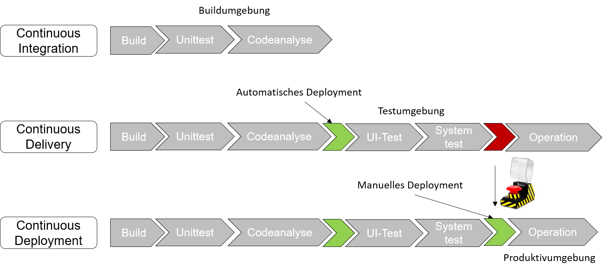
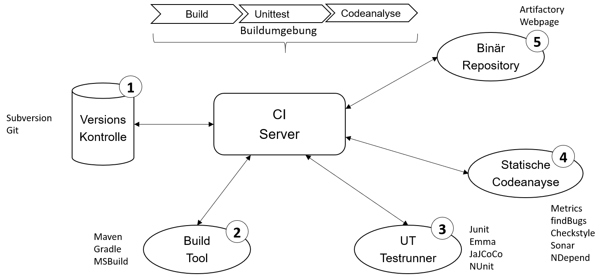
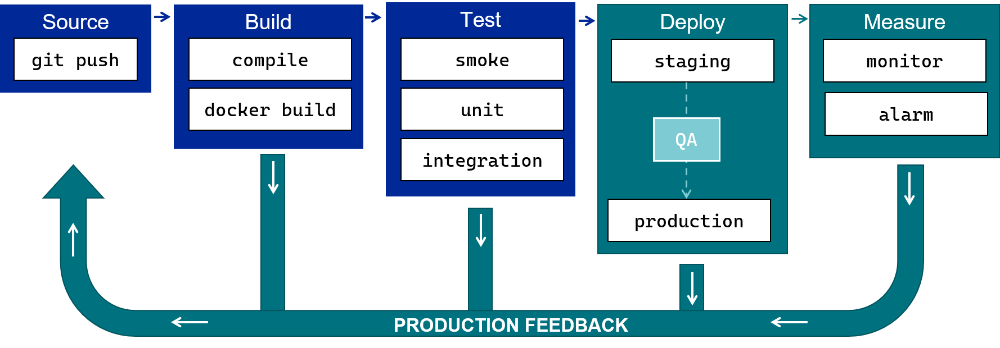
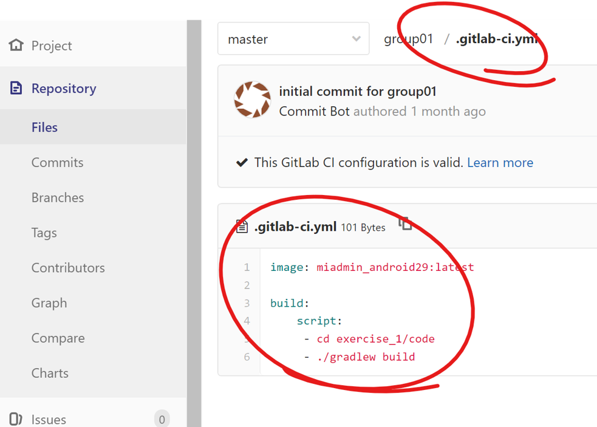

# CI/CD und Pipelines

## Lernziele


Bedeutung u~~n~~d Möglichkeiten des automatischen Buildmanagements **kennen lernen**

\
Motivation
----------

### Szenario 1

* Ein Team-Mitglied checked am Freitag Abend den letzten BugFix ein.
* Das Team-Mitglied is die kommende Woche erkrankt.
* Sie möchten bzw. müssen am Montag ein Release erstellen.
* Allerdings fehlt eine wichtige Datei des Team-Mitglieds im Repository.

❓ Wie hätte das verhindert werden können?

### Szenario 2

* Ihr Team besteht aus 8 Entwicklern.
* »Normalerweise« wird das Release immer auf dem Rechner eines speziellen Team-Mitglieds gebaut.
* Das Team-Mitglied ist am fraglichen Tag leider erkrankt.
* Sie bauen daher auf dem Rechner eines anderen Team-Mitglieds.
* Nach Auslieferung startet die Software beim Kunden nicht.

❓ Was ist passiert und wie hätte das verhindert werden können?

## CI/CD

* Kurzform für **Continuous Integration/Continuous Deployment**
* Befähigt Entwickler-Teams Software **schneller zu entwickeln**, **zu testen** und **in Betrieb zu nehmen**
* CI/CD **reduziert die menschlichen Interaktionen** durch einen **möglichst hohen Automatisierungsgrad**
* **Ausnahme**: Die Finale Inbetriebnahme einer Software in eine produktive Umgebung

### Was wäre ohne Continuous Integration

Um die Notwendigkeit von **Continuous Integration** zu verstehen hilft es sich vorzustellen was ohne CI wäre:

* **Manuelle Koordination von Entwicklungsaufgaben** im Entwickler-Team
* **Organisationsweite Abstimmungen** wann, wer welche Features und Fehlerkorrekturen umsetzt
* **Hoher Abstimmungsbedarf** um konkurrierende Tätigkeiten zu vermeiden
* Als Resultat: **hohe Kosten**, **langsame Entwicklungszyklen**, **hohe Fehlerraten** und ein genervtes Entwickler-Team
* **Kommunikationsaufwand** und **Kosten** steigen exponentiell mit Größe der Teams

### Reduktion von Auslieferungsrisiken

* Es wird die Abhängigkeit zu einzelnen Personen mit "Spezialwissen" reduziert
* Es wird die Gefahr reduziert, dass sich einzelne Personen nicht an Prozesse halten oder diese fehlerhaft durchführen
* Es wird die Gefahr reduziert, dass eine Fehlkommunikation zwischen den beteiligten stattfindet
* Regelmäßiges Deployment von Artefakten, die die CI erfolgreich durchlaufen haben

### **Continuous Delivery/Deployment**

* Kontinuierliche Validierung der Code-Basis durch automatisiertes Bauen und Testen

### **Continuous Integration**

* Regelmäßiges Deployment von Artefakten, die die CI erfolgreich durchlaufen haben

## CI vs CD

**Ziel**

* Release- und Deployment-Prozess schneller und zuverlässiger gestalten

**Continuous Delivery**

* Automatisiertes Vorbereiten eines Releases für die Inbetriebnahme
* Jeder mit entsprechenden Berechtigungen kann auf dieser Basis eine Inbetriebnahme durchführen

**Continuous Deployment**

* Automatisierte Inbetriebnahme von (allen) Code-Änderungen ohne explizite Freigabe

<figure><figcaption></figcaption></figure>

Continuous Integration Best Practices\


Wie lassen sich die zuvor genannten Probleme angehen?

* Nutzung eines Revisionssystem / Code Repository durch alle Entwickler (z.B: Git)
* Automatisierte Builds (nach jedem Code Check-In/Commit)
* Automatisierte Tests nach jedem Build
* Regelmäßige Check-Ins/Commits durch Entwickler
* Jeder Check-In/Commit baut
* Sichtbarkeit über Status des Builds
* Produktionsnahes Testen
* Automatisiertes Deployment auf Testsysteme
* ...

### CI Setup

<figure><figcaption></figcaption></figure>

## Pipeline

Eine Pipeline ist eine ausführbare Spezifikation aller Schritte, um eine neue Version einer Software auszuliefern.

GitLab bietet eine integrierte Lösung für CI/CD an, die es Entwicklern ermöglicht, ihre Builds, Tests und Deployments nahtlos zu automatisieren. GitLab CI/CD ist in GitLab integriert und nutzt eine YAML-Datei (`.gitlab-ci.yml`), um Pipelines zu definieren.\


<figure><figcaption></figcaption></figure>

### Komponenten einer GitLab CI/CD Pipeline

Eine GitLab CI/CD Pipeline besteht aus mehreren Komponenten, die zusammenarbeiten, um den gesamten CI/CD-Prozess zu automatisieren:

*   #### Jobs

    Ein Job ist die kleinste Einheit einer Pipeline und führt eine spezifische Aufgabe aus, wie z.B. das Kompilieren von Code, das Ausführen von Tests oder das Bereitstellen von Anwendungen. Jobs werden in der .gitlab-ci.yml Datei definiert und enthalten Skripte, die ausgeführt werden sollen.
*   **Stage**

    Jobs werden in Stages gruppiert, die in einer bestimmten Reihenfolge ausgeführt werden. Typische Stages sind build, test und deploy. Alle Jobs innerhalb einer Stage werden parallel ausgeführt, und die nächste Stage beginnt erst, wenn alle Jobs der vorherigen Stage erfolgreich abgeschlossen sind.
*   #### Runner


    Ein GitLab Runner ist ein Agent, der die Jobs in einer Pipeline ausführt. Runner können auf verschiedenen Umgebungen ausgeführt werden, einschließlich lokaler Maschinen, virtueller Maschinen und Kubernetes-Clustern.


*   #### Artifacts


    Artifacts sind Dateien, die von Jobs erzeugt und zwischen den Stages weitergegeben werden. Beispielsweise kann ein Build-Job eine kompiliertes JAR-Datei erzeugen, die dann in einem späteren Deploy-Job verwendet wird.

## Pipeline - Einteilung

Die pipeline besteht aus drei Teilabschnitten

* **Projekt Pipeline**
  * Installiert Dependencies
  * Führt Linters aus
  * Führt ggf. weitere Skripte aus, die mit dem Source Code in Verbindung stehen
* **Continuous Integration Pipeline**
  * Baut und Testet den Code
  * Stelle eine auslieferbare (engl. deployable) Version des Codes bereit
* **Deploy Pipeline**
  * Stellt die zuvor gebaute, ausführbare Version des Codes auf der gewünschten Umgebung bereit

### Beispiel einer einfachen GitLab CI/CD Pipeline

Erstellen Sie eine Datei namens .gitlab-ci.yml im Stammverzeichnis Ihres Projekts.

```
stages:
  - test
  - build
  - deploy

build:
  stage: build
  script:
    - echo "Building the application..."
  artifacts:
    paths:
      - target/*.jar

test:
  stage: test
    script:
      - echo "Running tests..."

deploy:
  stage: deploy
    script:
      - echo "Deploying the application..."
  needs:
    - job: build
      artifacts: true
  rules:
    - if: $CI_COMMIT_REF_NAME == "main"
```

## Pipeline, Stage, Job Aufbau

```
Build
  npm Dependecies installieren
  ESLint ausführen
  Code-Minifier ausführen
Test
  Unit Tests, Funktionale Tests und Ende-zu-Ende Test ausführen
  pgk ausführen und Code zu einer NodeJS Anwendung kompilieren
Deploy
  Produktion
    EC2 Instanz auf AWS starten
Test
  Auf lokalem Deployment Server starten
```

## Dazu passende GitLab Pipeline

* In GitLab `.gitlab-ci.yml` im Root-Ordner des Repositories

```
image: node:10.5.0

stages:
  - build
    - test
      - deploy
      
before_script:
  - npm install
  
build-min-code:           # Build 
  stage: build            
  script:                  
     - npm install        # npm Dependencies installieren
    - npm run minifier    # und ausführen
            
run-unit-test:            # Test
  stage: test
  script:
    - npm run test       # Tests ausführen
```


## GitLab Beispiel

<figure><figcaption></figcaption></figure>

### Best Practices für GitLab CI/CD

* Minimierung von Hardcoding: Verwenden Sie Umgebungsvariablen und GitLab Secrets, um sensible Daten und Konfigurationen zu verwalten.
* Parallelisierung: Nutzen Sie die Möglichkeit zur parallelen Ausführung von Jobs, um die Pipeline-Geschwindigkeit zu erhöhen.
* Caching: Verwenden Sie Caching, um wiederholte Schritte wie das Bauen von Abhängigkeiten zu beschleunigen.

## GitHub Actions

```
name: Java CI

on: [push]

jobs:
  build:
    runs-on: ubuntu-latest

    steps:
      - uses: actions/checkout@v2
      - name: Set up JDK 1.8
        uses: actions/setup-java@v1
        with:
          java-version: 1.8
      - name: Build with Gradle
        run: ./gradlew build
      - uses: actions/upload-artifact@v2
    	with:
      	  name: Package
          path: build/libs
```

### Links und Ressourcen

* [GitLab CI/CD Dokumentation](https://docs.gitlab.com/ee/topics/build\_your\_application.html)
* [GitLab CI/CD Pipelines](https://docs.gitlab.com/ee/ci/pipelines/index.html)
* [Predefined CI/CD variables](https://docs.gitlab.com/ee/ci/variables/predefined\_variables.html)
* [Blog: Automated Releases Tutorial](https://about.gitlab.com/blog/2023/11/01/tutorial-automated-release-and-release-notes-with-gitlab/)


###

\
\
