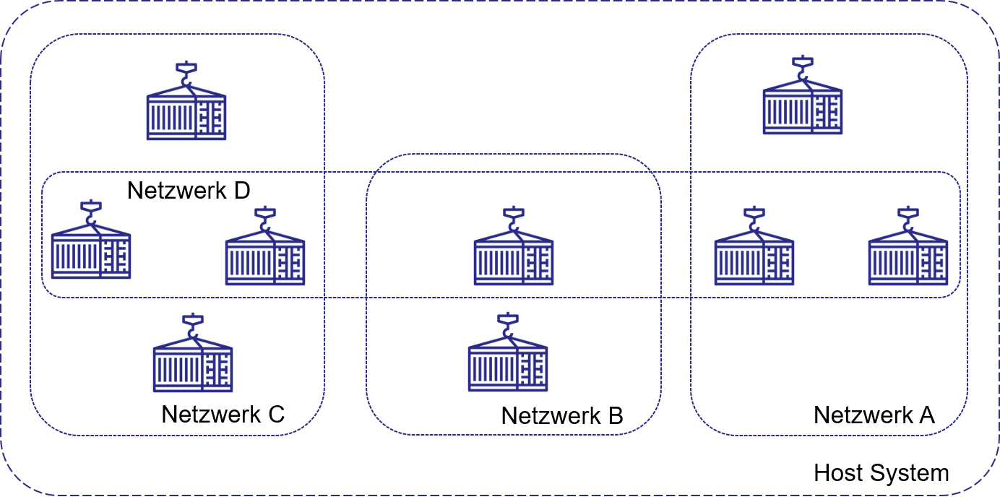

# Docker Container

## Ziele und Kompetenzen

* Vorteile von Virtualisierung und Containern **verstehen**
* Containerisierung kennen lernen und eigene Container erstellen und starten **können**

## Motivation

**Die Idee hinter Containern**

Es gibt verschiedene Möglichkeiten umfangreiche Anwendungen zu installieren. Wir betrachten hier einige Möglichkeiten eine solche Anwendung zu installieren.

**Intuitives Vorgehen**

* Alle Dienste, Server-Komponenten und z-B- Datenbanken werden auf einer Maschine installieren
* Vorteile:
  * einfache Installation
  * einfache Kommunikation unter den Diensten
  * zunächst einfache Verwaltung und Wartung, da nur ein System verwaltet wird
* Nachteile:
  * Über die Zeit immer schwerer wartbar, da Änderungen am System nur noch schwer nachvollziehbar bzw. reproduzierbar sind

**Fortgeschrittenes Modell**

* Alle Dienste, Server-Komponenten und Datenbanken werden auf unterschiedlichen Servern installiert
* Hier benötigt man unter Umständen sehr viel Hardware, die am Ende des Tages nicht ausgelastet wird aber in Anschaffung und Unterhalt teuer ist.
* **Lösung:** Alle Dienste, Server-Komponenten und Datenbanken werden in **virtuellen Maschinen** (VM) installiert.
* Konkret würde dies z.B. bedeuten:
  * eine virtuelle Maschine für die Datenbank
  * eine virtuelle Maschine für das Backend
  * eine virtuelle Maschine für den Web Server
  * eine virtuelle Maschine für das Monitoring
* Vorteile:
  * Die VMs sind voneinander unabhängig
  * Ein Problem in einer virtuellen Maschine beeinflusst nicht die anderen Maschinen
  * Von den VMs lassen sich Backups erstellen und bei Bedarf wiedr einspielen
* Nachteile:
  * Es müssen (sehr) viele (virtuelle) Maschinen gewartet und überwacht werden (Betriebssystem-Updates, Software-Update)
  * Erhöhter Ressourcenverbrauch, da virtuelle Maschinen exklusiv Hardware in Anspruch nehme

***

**Wie funktioniert eine virtuelle Maschine?**

* Eine virtuelle Maschine simuliert eine vollständige Hardware, auf der ein vollwertiges Betriebssystem installiert wird
* Einer solche virtuelle Maschine werden dedizierte Ressourcen des Host-Systems zugewiesen
  * CPU bzw. Kerne
  * Hauptspeicher
  * Festplattenplatz
* **Probleme**:
  * Die Ressourcen stehen weder dem Host-System, noch den anderen virtuellen Maschinen zur Verfügung
  * Die virtuelle Maschine bringt ihren ganz eigenen Hardware Abstraction Layer und simuliert die ganze Hardware


**Container Modell**

* Dienste, Server-Komponenten und Datenbanken werden in kleinen, isolierten Einheiten (aka Containern) betrieben

z.B.

* Container für Front-End
* Je ein Container pro Service
* Je ein Container pro Datenbank


**Vorteile**

* Leichtgewichtig
* Unabhängig
* Konfigurierbar

**Nachteile**

* Verwaltung von sehr vielen Container erfordert eine Lösung (Stichwort Kubernetes)

***

## Container Grundlagen

**Wie funktionieren Container?**

* Private Sichten (Container) bilden isolierte User-Space-Instanzen für verschiedene Anwendungen
* Hardware-Virtualisierung, Isolation und API (Betriebssystem-Kernel, vgl. Betriebssysteme aus SEB2) werden kontrolliert
* Keine Virtualisierung des Betriebssystems, sondern eine Art der »User-Space-Virtualisierung« auf Basis von Kernel Features.

**Was ist ein Container von Julia Evans**


**Beispiel einer Software in Containern**


**Automatisierung mit Containern**

* Mit Container-Technologie lässt sich sehr viel (alles) automatisieren
* Stichwort: GitLab CI/CD (später mehr dazu)
* Stichwort: Infrastructure as Code (IaS)
* Werkzeuge: Ansible, Salt, Puppet, Vagrant, GitLab CI/CD, GitHub Actions..

**Container können...**

* Unabhängig voneinander gewartet und aktualisiert werden
* Können in unterschiedlichen Versionen betrieben werden
* Beeinflussen sich nicht gegenseitig

**Container 101**

* Container enthalten eine Software und alle Abhängigkeiten
* Gestartet wird ein Container aus einem Abbild (engl. image)
* Container verhalten sich auf allen Maschinen gleich (Entwickler-Maschine, Server, Cloud-Anbieter, ...)
* Für die Software sieht der Container aus wie eine eigene Maschine
* Die Software weiß nicht, dass sie in einem Container steckt
* Wird ein Container gelöscht, werden keine Konfigurationsreste auf dem Host / dem Betriebssystem hinterlassen

> Daumenregel: Ein Dienst pro Container

## Möglichkeiten mit Containern

**Beispiel Microservices**

Alles auf einer Maschine oder jeder Dienst in einem eigenen Container?

* Container können über verschiedene Maschinen verteilt werden


***

**Container und Netzwerke**

Container können über eigene Netzwerke miteinander kommunizieren



**Nutzung von Standard-Ports in Containern**


***

**Reverse Proxy**

Ein Reverse Proxy löst dabei so manche Probleme einzelner Maschinen...


***

## Container Umgebungen


## Docker Compose

Um mehrere Container zu orchestrieren kann `Compose`genutzt werden:

```bash
version: '3'
services:  my_db:
    image: postgres:9-alpine
    environment:
      POSTGRES_DB: mydb
      POSTGRES_PASSWORD: topsecret
      POSTGRES_USER: user1
volumes:
  - db-data:/var/lib/postgresql/data
restart: always
networks:
  - my_network
```

* Eine Konfigurationsdatei: `docker-compose.yml`
* Container werden mit `docker-compose up` gestartet
* Container werden mit `docker-compose down` gestoppt

**Vorsicht bei fertigen Images**

* Am Beispiel des _postgres_-Images
* Was steckt in dem Image?
* Wirklich nur die Datenbank?
* Vielleicht ein BitCoin Miner?
* Vielleicht ein SpamBot?
* Vielleicht ein Skript das alles DB-Einträge an jemanden übermittelt?
* Beim offiziellen Image weniger kritisch


## Image erstellen

Wie bekommt man Software in einen Container?

* Docker installieren (Linux, Windows, macOS)
  * Variante 2: Eigenes Image »bauen«, Container starten

```bash
FROM alpine
RUN apk --no-cache add inotify-tools jq openssl util-linux bash
COPY dumpcerts.sh /dumpcerts.sh
RUN chmod +x /dumpcerts.sh
COPY entrypoint.sh /entrypoint.sh
ENTRYPOINT [ "/entrypoint.sh" ]
```

* In einem File, z.B. `Dockerfile`

## Aufgabe

1. Docker installieren
   1. Docker Desktop (Windows, Mac, Linux): [https://www.docker.com/products/docker-desktop/](https://www.docker.com/products/docker-desktop/)
   2. Install Docker Engines: [https://docs.docker.com/engine/install/](https://docs.docker.com/engine/install/)
2. Erstellen Sie ein [`Dockerfile`](https://docs.docker.com/engine/reference/builder/) auf Basis dessen Sie ein Image erstellen werden.
3. Installieren Sie in Ihrem Image [nginx](https://www.nginx.com/) als Webserver. Hinweis: Nutzen Sie hierfür **nicht** das _nginx_ Image.
4. Erstellen Sie eine Default-Seite (`index.html`), die von Ihrem Webserver standardmäßig angezeigt wird.
5. Die `index.html` Datei soll auf Ihrem Host System vorliegen und via [`Volume`](http://nginx.org/en/docs/beginners\_guide.html) oder [`Bind Mount`](https://docs.docker.com/storage/bind-mounts/) innerhalb des Containers bereitgestellt werden.
6. Stellen Sie sicher, dass _nginx_ mit dem Starten des Containers startet.
7. Routen Sie den Port 8080 auf den Port 80 Ihres Containers und öffnen Sie die Datei vom Browser Ihres Hostsystems via (`http://localhost:8080/index.html`)
8. Ändern Sie die Datei auf dem Host-System und laden Sie die Datei neu im Browser.
9. Erstellen Sie eine README.TXT und notieren Sie die Zeile wie der Container über die Kommandozeile gebaut und gestartet werden kann.

### Bewertungskriterien

* Das Image wird auf Basis des bereitgestellten `Dockerfile` und der README.TXT erstellt und der Container gestartet.
* Die bereitgestellte `index.html` wird via `http://localhost:8080` abgefragt.
* Im Anschluss wird die `index.html` auf dem Host-System verändert und neu im Browser geladen, die Änderungen sollen sich hierbei widerspiegeln.

Referenzen

\[1] c't wissen Docker DOCKER – Komplexe Software einfach einrichten, Heise Medien GmbH, 2019

\[2] Offizielle Docker Dokumentation: https://docs.docker.com/
