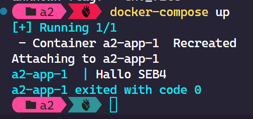

# Compose Übungsaufgabe

### Aufgabe 1: Einfaches Docker-Compose Projekt

Erstellen Sie Docker-Compose-Projekt, das einen einfachen Webserver mit einer HTML-Seite bereitstellt.

* Nutzen Sie als Images `nginx:latest`
* Erstellen Sie einen Ordner namens `html` im selben Verzeichnis wie Ihre`docker-compose.yaml`-Datei und legen Sie eine einfache `index.html`-Datei mit einem beliebigen Inhalt darin ab.
* Verwenden Sie ein Bind Mound um den Ordner .`/html` auf den Ordner `/usr/share/nginx/html` im Container zu mounten.
* Routen Sie den Port 8080 auf den Port 80 Ihres Containers.
* Führe Sie den Befehl `docker-compose up` aus, um dein Docker-Compose-Projekt zu starten. Sie können den Webserver unter `http://localhost:8080` aufrufen und die Inhalte der `index.html`-Datei sehen.&#x20;
* Ändern Sie die Datei wie in der vorherigen Aufgabe auf dem Host-System  und lasse Sie sich diese Änderungen über ein Refresh Ihres Browser anzeigen.

### Aufgabe 2: Umgebungsvariablen in Docker-Compose

Erstellen Sie eine Docker-Compose-Datei, die eine Anwendung startet, die eine Umgebungsvariable verwendet, um eine Konfiguration anzupassen.

* Verwenden Sie ein beliebiges Image&#x20;
* Nutzen Sie das [command ](https://docs.docker.com/compose/compose-file/05-services/#command)Element und führend damit folgenden Befehl aus:\
  \
  `sh -c "echo Hallo $$MSG"`\

* Setzen Sie mit dem [environment](https://docs.docker.com/compose/compose-file/05-services/#environment) Element eine Umgebungsvariable `MSG` und weisen Ihr den Wert "Welt" zu.&#x20;
* Führen Sie  den Befehl `docker-compose up` aus. Die Anwendung wird gestartet und sollte "Hallo Welt" ausgeben.

Ihre Ausgabe sollte ähnlich zu folgender sein: \


<figure><figcaption></figcaption></figure>

* Löschen Sie nun den environment Eintrag aus der _docker-compose.yml_ Datei.&#x20;
* Legen Sie im gleichen Ordner, eine Datei an mit dem Namen **.env**&#x20;
*   Schreiben Sie in die Datei eine Variable \


    ```properties
    MSG=SEB4
    ```
* Ändern Sie nun in der _docker-compose.yml_ Datei den command Eintrag wie folgt\
  \
  `sh -c "echo Hallo ${msg}`
* Führen Sie  den Befehl `docker-compose up` aus. Die Anwendung wird gestartet und sollte "Hallo Welt" ausgeben.

Ihre Ausgabe sollte ähnlich zu folgender sein:&#x20;

<figure><figcaption></figcaption></figure>

**Hinweis**: Über die Syntax `${variablenname}` wird in Docker Compose auf Variablen zugegriffen.

### Aufgabe 3: Volumes

Erstellen Sie ein Compose-Projekt, das eine Datenbank enthält und einen Persistenten Speicher für die Daten verwendet.

* Verwenden Sie das MySQL 5.7 Image
* Nutzen Sie ein Named Volume mit dem Namen **db\_data**
* Stellen Sie sicher, dass sie Datenbank, User und Passwort mittels Umgebungsvariablen setzen (entweder in der Compose-Datei oder in einer .env-Datei)

### Aufgabe 4: Mehrer Dienste

Erstellen Sie ein Compose-Projekt, das eine Datenbank wie aus Aufgabe 3, ein Webserver wie aus Aufgabe 1 und zusätzlich ein Node.js Server startet.&#x20;

Stellen Sie mittels [depends\_on](https://docs.docker.com/compose/compose-file/05-services/#depends\_on) sicher, dass der MySQL Server vor dem Node-Server startet.

### Aufgabe 5: Skalierung&#x20;

Erweitern Sie das vorhandene Docker-Compose-Projekt aus Übung 4, um die Skalierung des Backend-Dienstes zu ermöglichen.

Variante 1: Nutzen Sie das [deploy ](https://docs.docker.com/compose/compose-file/deploy/)Element um 3 Replicas des Backends zu erzeugen. \


Variante 2: Entfernen Sie das deploy-Element und starten Sie Compose mit folgendem Befehl:\
\
`docker-compose up --scale backend=3`

In beiden Fällen sollten Ihre Container ungefähr so in Docker Desktop dargestellt werden:

<figure><figcaption><p>Skalierung von Docker Containern</p></figcaption></figure>

Ändern Sie die Compose-Datei zurück in Variante 1 und starten Sie das Projekt mit dem Befehl aus Variante 2. Wie viele Backend Container werden durch diese Kombination gestartet?
