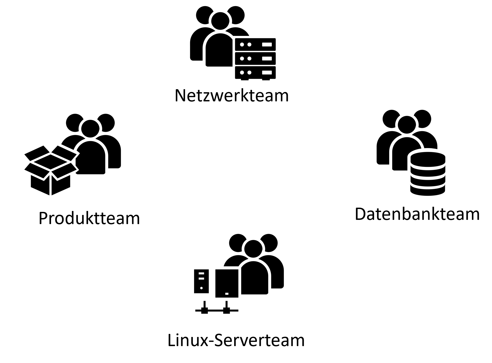
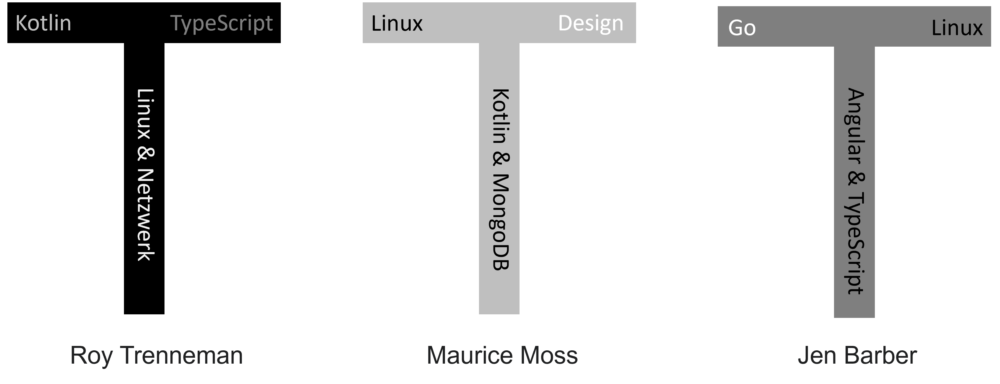
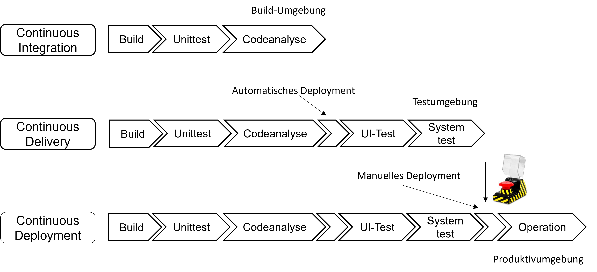

# DevOps Grundlagen

## Ziele und Kompetenzen

In dieser Einheit werden Sie

* Grundlegende Probleme der herkömmlichen Entwicklungs- und Betriebsorganisation **kennen** lernen,
* **Verstehen** was mit DevOps erreicht werden soll .
* Sie lernen einige Möglichkeiten **kennen**, wie diese Ziele erreicht werden können.

## Projekt Phoenix

In diesem Abschnitt betrachten wir einige Beispiele aus dem Buch _Project Pheonix_.

Die Ausgangssituation stellt sich wie folgt dar:

> Bill Palmer ist IT-Manager bei Parts Unlimited. An einem Dienstag morgen erhält er auf der Fahrt zur Arbeit einen Anruf seines CEO. Die neue IT-Initiative der Firma mit dem Codenamen Projekt Phoenix ist entscheidend für die Zukunft von Parts Unlimited, aber das Projekt hat Budget und Zeitplan massiv überzogen. Der CEO will, dass Bill direkt an ihn berichtet und das ganze Chaos in neunzig Tagen aufräumt, denn sonst wird Bills gesamte Abteilung outgesourct.

**Was ist passiert? - Fail 1**

* Die Gehaltssoftware spuckt bei einem signifikanten Teil der Mitarbeiter nur Hieroglyphen aus, anstatt das tatsächliche Gehalt zu berechnen.
* Gehälter drohen, nicht ausgezahlt zu werden. Der Betriebsrat würde Alarm schlagen und die Presse negative Schlagzeilen zu Parts Unlimited schreiben.

**Was ist passiert? - Fail 2**

* Weil sich unterschiedliche Teams nicht abgestimmt haben, dauert der Rollout einer Kassensoftware viel zu lange. Die Datenbank-Migration dauert nicht nur Stunden, sondern Tage.
* Doof, dass die Kassen am nächsten Tag wieder öffnen und ohne Software nicht arbeiten können. Filialen nehmen die Kreditkartendaten der Kunden entgegen und schreiben sie auf, was aber ein Sicherheitsverstoß ist...

### Zitate aus „Projekt Phoenix“

**Über die Zusammenarbeit von Development und Operations**

> "Es ist erstaunlich, wie die Übergaben zwischen Entwicklung und IT Operations jedes Mal in die Hose gehen. Aber angesichts des dauerhaften Kleinkriegs zwischen den beiden Gruppen sollte ich nicht überrascht sein."

**Über Brent, dem Alleskönner, von dem alles abhängt**

> „Ich sage ja nicht, dass Brent das absichtlich macht, aber ich frage mich, ob Brent sein Wissen als eine Art Superheldenkraft sieht. Vielleicht will ein Teil von ihm das gar nicht aufgeben. Er hat damit eine Stellung inne, von der ihn niemand vertreiben kann.“ „Vielleicht, vielleicht auch nicht“, sage ich. „Aber ich werde euch erzählen, was ich sicher weiß: Jedes Mal, wenn wir Brent etwas fixen lassen, das keiner von uns wiederholen kann, wird Brent ein bisschen klüger und das gesamte System ein bisschen dümmer. Wir müssen dem ein Ende bereiten.“

**Über erfolgreiche Teams**

> "Ein großartiges Team bedeutet nicht, dass es nur aus den klügsten Köpfen besteht. Ein Team wird dann gut sein, wenn sich alle vertrauen können. Es entsteht viel Power, wenn diese Magie zwischen den Leuten existiert."

**Über die Zeit, in der ein neues Produkt auf dem Markt sein muss (Time-to-Market)**

> Produkte müssen in sechs Monaten auf dem Markt sein. Höchstens in neun. Ansonsten schnappt sich eine chinesische Firma unsere Idee, bringt sie in die Läden unserer Konkurrenz und bekommt damit einen großen Marktanteil. In diesen Zeiten starker Konkurrenz muss man schnell im Markt sein und auch die Fehler schnell machen. Wir können uns keine mehrjährigen Entwicklungszyklen mehr leisten und erst am Ende erkennen, ob das Produkt gut ist oder beim Kunden durchfällt. Es müssen kurze und schnelle Zyklen sein, in denen das Feedback aus dem Markt fortlaufend einfließt.

<figure><figcaption>
Projekt Phoenix
</figcaption></figure>

**Projekt Phoenix**\
Gene Kim, Kevin Behr & George Spafford\
Deutsche Ausgabe\
O’Reilly, 2015\
ISBN 978-3958751750\

## Motivation

Wie wurde früher\*) Software entwickelt? Pro Technologie, Fachbereich, Einsatzgebiet ein eigenes Team:

\*) häufig ist dies auch heute noch der Fall

Hierdurch entsteht ein hoher Abstimmungsbedarf, wenn etwas von einem anderen Team benötigt wird.

### Der ewige Interessenskonflikt

Bildquelle: [https://imgflip.com/](https://imgflip.com/)

* Es werden dringliche Zuarbeiten von anderen Teams oder Abteilungen benötigt
* Es werden Tickets erzeugt
* Wartezeiten entstehen

## Die Lösung: DevOps?

Um herauszufinden was DevOps ist, stellen wir uns einmal folgende Frage:

**Frage**: Wie könnte der Konflikt zwischen Teams gelöst werden?

**Lösungsidee**: Cross-funktionale Teams

* Ein _gemeinsames_ Produktteam

* Hinterfragen, welche Rolle im DevOps-Team eingenommen werden soll
* Welche Fähigkeiten fehlen im Team?

**Was soll mit Cross-funktionalen Teams erreicht werden?**

* Team ist **eigenständig lieferfähig**
* Alle **benötigten Skills** sind im Team _vorhanden_
* Team hat alle **erforderlichen Befugni**_sse_
* Umdenken in der Organisation: _»_**Betroffene zu Beteiligten machen**_«_
* _**Schnelle Lieferung von**_ Software-Änderungen optimieren
* _»_**Lead Time**_«_ soll **möglichst gerin**_g_ gehalten werden, daraus resultierende _kürzere Time-to-Market_ soll Marktvorteile sichern

**Wie erreichen wir die vorherigen Ziele?**

* _**Automatisieren**_ von Prozessen
* Minimieren von **Übergaben**
* **Cross-funktionale** Teams
* **Agile Vorgehensmodelle** (Scrum oder Kanban)
* Gute **Feedback- und Fehler-Kultur**
* **Fachlicher Schnitt** anstelle eines techn. Schnitts als Kernelement

**Wie können Teams selbstständig arbeiten**

* Abhängigkeiten reduzieren
* Laufzeitumgebungen (Server, Container) selbstständig definieren
* Netzwerkumgebungen anpassen (CDN)
* SelfServices für alles was nicht in der Verantwortung des Teams liegt
* Mehr als ein Kollege kennt sich in (Teil-)Bereichen der Software/Infrastruktur aus (vgl. T-Shaped Skills)
* Team »fühlt sich verantwortlich« für das gesamte Softwareprodukt (Entwicklung, Betrieb, und das 24x7)

**Zielbild: T-Shaped Skills**

* Erstmals 1991 von David Guest eingeführt, von Tim Brown (CEO von IDEO Design Consultancy) für Bewerberprofile eingesetzt

Geschichte der T-Shaped Skills

> The first “official” reference to T-shaped skills, or a T-shaped person, was made by David Guest back in 1991. The concept gained real popularity after the CEO of IDEO Design Consultancy firm – Tim Brown – endorsed the idea when looking over applicants’ resumes. Brown’s idea? Using the search for T-shaped skills/a T-shaped person helps build the very best interdisciplinary teams within a company. It, in turn, leads to a stronger, more efficient and potentially groundbreaking company.

> However, historically speaking, the term T-shaped man can be dated back to the 1980s. At that time, McKinsey & Company used the term widely on internal documents and publications that were seen primarily by upper management. The term was referring to the idea that the T-shaped man (which also included women by that point) was ideal for recruitment as an employee and should also be looked for in terms of the consultants and partners the company decided to work with.

Quelle: [https://corporatefinanceinstitute.com/resources/careers/soft-skills/t-shaped-skills/](https://corporatefinanceinstitute.com/resources/careers/soft-skills/t-shaped-skills/)

Beispiel: T-Shaped Skills

Weiterführende Artikel zu T-Shaped Skills (Drippy T-Shape Skill-Modell): https://synapsenstau.de/t-shaped-skills/

**Infrastructure as Code (IaC)**

* Gesamte Infrastruktur wird in Konfigurationsdateien beschrieben
  * Bild-Umgebungen
  * Laufzeitumgebungen
  * Firewall-Regeln
  * Skalierungsparameter
  * Konfigurationen für Anwendungen
* Spezielle Auszeichnungssprache (JSON, YAML) in Form einer Domain Specific Language (DSL)
* Beschreibungsdateien werden versioniert und liegen wie Code in einem Repository (z.B. Git)

**Metriken**

Metriken geben ein Einblick wie es unserer Applikation geht, indem kontinuierlich Messwerte geliefert werden, die visualisiert werden können. Außerdem werden wir alarmiert, wenn Messwerte bestimmte Schwellwerte unter- oder überschreiten.

Zur Abgrenzung: Metriken vs. Monitoring vs. Alarmierung

> **Metriken**: Helfen Sachverhalte zu verstehen und zu bewerten. (vgl. SEKS: Software-Metriken)

> **Monitoring**: Visualisierung von Metriken

> **Alarmierung**: Aktiver Hinweis beim Unter- oder Überschreiten von Schwellwerten (E-Mail, SMS, Push Notification, Ampelsystem)

Wo werden Metriken eingesetzt?

* Alle Cloud-Anbieter unterstützen unterschiedlichste Messtechnologien- und Plattformen
* Jedes Rechenzentrum nutzt Metriken zur Überwachung
* Auch ein NAS im privaten Einsatz nutzt Metriken (Durchsatz, verfügbarer Speicherplatz etc.)
* Es gibt technische als auch fachliche Metriken (vgl. SEKS Business- und Projektmetriken)
* Große Plattformen (Amazon, etsy etc.) werten Metriken automatisch aus und spielen Vorgängerversionen automatisiert ein, sollte in Update der Shop-Software Probleme verursachen
* Metriken können z.B. für A/B-Testing genutzt werden

**Beispiel: Technische Metriken**

* Durchschnittlich verarbeitet HTTP-Requests
* Durchschnittliche Verarbeitungsdauer eines HTTP-Requests
* Anzahl von HTTP-Requests, die mit einem Fehler beantwortet werden
* CPU-Auslastung (über die Zeit gemessen)
* Arbeitsspeicherauslastung (steigend, greift der Garbage Collector etc.)
* Netzwerkauslastung (Peaks)
* Latenzen
* …

**Beispiel: Fachliche Metriken eines Web Shops**

* Anzahl Neuregistrierung innerhalb der letzten Stunde
* Heutige Kündigungsquote im Vergleich zum selben Tag der Vorwoche
* Anzahl an- bzw. abgemeldeter Kunden am Newsletter
* Durchschnittlicher Einkaufs-/Warenkorbwert am heutigen Tag
* Umsatz in € über den Web Shop an diesem Tag
* Anzahl der abgeschickten Bestellungen in der letzten Stunde und deren Bezahlungsart
* …

**CI/CD**

Continuous Integration

Continuous Deployment

**Feedback und verbessertes Lernen**

* Produktideen sind nichts anderes als Hypothesen.
* Je schneller eine Organisation Hypothesen einzeln oder parallel in Produktion bringt und aussagekräftige Metriken über den Erfolg oder Misserfolg sammeln kann, desto früher können aus diesen Informationen neue Hypothesen gebildet werden, und der Zyklus beginnt erneut.
* Das Ergebnis ist eine Organisation, die ihre Kunden nach und nach immer besser versteht.
* Dasselbe gilt auch für externe Impulse durch Wettbewerber oder neue Technologien: Je kürzer der Feedbackzyklus ist, desto schneller kann die Organisation reagieren.

**Was gehört also alles dazu?**

**DevOps: Definition**

* DevOps beschreibt eine Form der Zusammenarbeit, bei der **Entwicklung und Betrieb** einer Software als **untrennbare Einheit** angesehen werden
* Kunstwort aus engl. »Development« = Entwicklung und »Operations« = Betrieb
* DevOps klingt wesentlich cooler als »EntBet«
* Mittlerweile auch Abwandlungen davon, z. B. _DevSecOps_, wo der Security-Aspekt explizit erwähnt wird (Berücksichtigung von Sicherheitslücken in einer Software und Umgebung)

## Aufgabe

[Verständnisfragen - Artikel zu DevOps](verstaendnisfragen.md)

## Exkurs: Bedingungsloses Grundeinkommen

Was hat das bedingungslose Grundeinkommen mit DevOps zu tun?

* Was ist eigentlich ein bedingungsloses Grundeinkommen?
* Wie findet eigentlich die Wertschöpfung statt?
* Was hat das alles mit DevOps zu tun?
