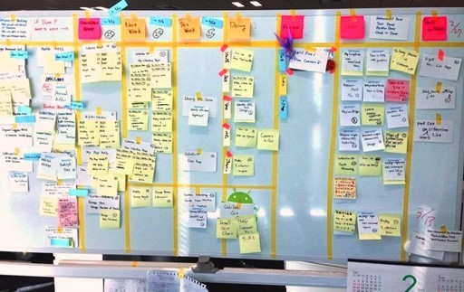
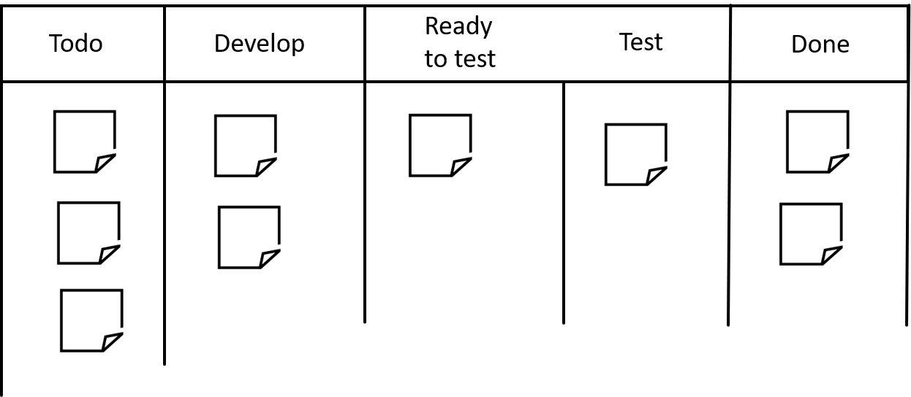
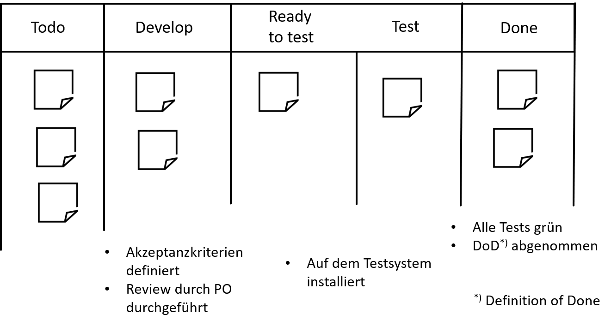

# Kanban

## Vor dem eigentlichen Thema... Workshop!&#x20;

## Lernziele

* Grundlegende Konzepte hinter Kanban **kennen lernen**
* Unterschiede (Vor- und Nachteile) gegenüber anderen agilen Ansätzen **verstehen**
* **Verstehen** wann Kanban vorzugsweise eingesetzt werden kann

## Kanban Ursprung

* Jap. _kan_ 看 (sichtbar) und _ban_  板 (Karte o.d Brett)
* Konzepte entstammen dem Toyota Production System (TSP)
* Konkret: Just-in-Time Scheduling System
  * Nur »machen« was benötigt wird
  * Nur »machen« wenn es benötigt wird
  * Nur »machen« wieviel benötigt wird

Kanban System wurde sowohl für die Produktion als die Software Entwicklung adaptiert.

## Toyota Kanban

> The kanban, a tool that describes **which and how many parts are used where and when, made just-in-time production possible**. The new kanban management system was adopted at all plants in 1963. By producing parts in accordance with the instructions on the kanban, **parts are delivered among the different plants only in the volumes needed, and inventories within each process can be eliminated**. As kanban came into widespread use, problems such as standardization of work and transport management were resolved one after another and production lines operated smoothly.

Quelle: [Toyota](https://www.toyota-global.com/company/history\_of\_toyota/75years/text/entering\_the\_automotive\_business/chapter1/section4/item4.html)

## Drei Prinzipien

* Visualize
* Limit Work in Progress
* Manage Flow

## Visualisieren - Dass Kanban Board

* **Information Fridge**
  * Muss immer wieder geöffnet werden, um nachzuschauen ob „etwas Neues drin ist“
  * Klassische Ticket-Systeme, digitale Boards etc.
*   **Information Radiator**

    * Große sichtbare Displays
    * Für das eigene Team und alle Interessierten
    * Aktualisierungen möglichst einfach halten
    * So groß wie möglich!!!
    * »Use it or lose it!«

    <figure><figcaption>
Rakuten Inc., <a href="https://commons.wikimedia.org/wiki/File:Lean_Kanban.jpg">https://commons.wikimedia.org/wiki/File:Lean_Kanban.jpg</a>, CC BY-SA 3.0 (<a href="https://creativecommons.org/licenses/by-sa/3.0">https://creativecommons.org/licenses/by-sa/3.0</a>)
</figcaption></figure>

## Kanban Board - Tipps

* Große Boards verwenden (s. Information Radiator)
* Digitale und physische Boards haben beide Vor- und Nachteile
* Bei ungeübten Teams möglichst physische Boards nutzen
* Regelmäßige Stand-Ups (Daily Stand-Up)
* Den Workflow anpassen, das Board reflektiert den aktuellen Workflow im Team
* Der Workflow kommt nicht vom Management, sondern vom Team
* Nicht zu viele Gedanken machen, Änderungen willkommen heißen

## Kanban Board - Beispielaufbau

<figure><figcaption>
Kanban Board - Beispielaufbau
</figcaption></figure>

## Enter & Exit Critera

<figure><figcaption>
Enter &#x26; Exit Criteria
</figcaption></figure>

## Priorisierung

* Anders als in Scrum:
  * Priorisierung kann fortwährend erfolgen täglich, u.U. auch wöchentlich oder zwei-wöchentlich
* Reihenfolge der Tickets am Board spiegelt die Priorität wider:
  * Es wird immer das am höchsten priorisiertes Ticket gezogen
  * No-Go: Ticket ziehen, das einem am meisten Spaß macht

## Work in Progress

* Abk.: WiP
* Beinhaltet alle begonnen aber noch nicht abgeschlossenen Aufgaben
  * Auch alle Aufgaben, an denen gerade nicht gearbeitet wird
  * Auch alle Aufgaben, für die gerade auf Zuarbeit geartet wird
* WiP-Limit
  * Anzahl an gerade in Bearbeitung befindlicher Aufgaben limitieren
  * Anzahl der Tickets
  * Typischerweise pro Spalte (in Bearbeitung, Test, Abnahme etc.)
* \

## Little's Law

* Ursprung: John D.C. Little
  * In den 1950ern einfach angenommen
  * Erst Ende der 1960er bewiesen
* Bedeutung: Je mehr gleichzeitig bearbeitet wird, desto länger dauert die Fertigstellung aller »Work Items«

<figure><figcaption></figcaption></figure>

## Auswirkung von Parallelität

\

<figure><figcaption></figcaption></figure>

## Auswirkung von WiP-Limits

<figure><figcaption></figcaption></figure>

## WiP-Limit Wisdoms

* Es gibt keine »goldene Regel«
* Beobachten und anpassen
* Guter Ansatz: »Stop starting, start finishing «
* Beispiel 1: Um Pairing zu forcieren kann ein WiP-Limit von _Teamgröße−1_ gewählt werden
* Beispiel 2: Existieren z.B. externe Abhängigkeiten (=Wartezeiten) kann ein WiP-Limit von _Teamgröße\*2_ gewählt werden um Wartezeiten (engl. idle time) zu vermeiden
* Beispiel 3: …

## Praxis Tipps

* Durchsatz erhöhen
* Verschwendung (jap. _muda_ 無駄) z.B. durch Wartezeiten oder Blocker vermeiden
* Probleme schnell lösen
* Kanban ermöglicht häufig Priorisierung (signifikanter Unterschied zu Scrum)
* Geeignet für kleine und bekannte Arbeitseinheiten (z.B. im Ops-Umfeld)
* Schlechter für Entwicklung, da Aufgaben geschätzt werden müssen
* WiP-Limits einhalten

\

\

\
\
\
