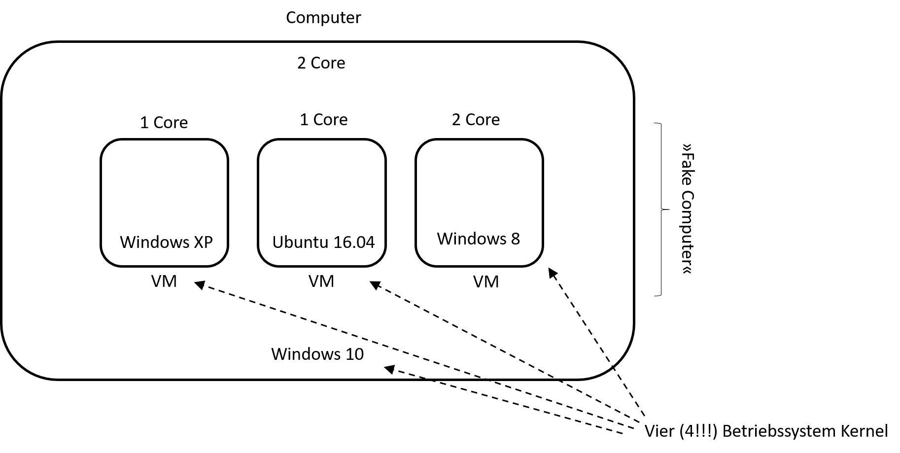
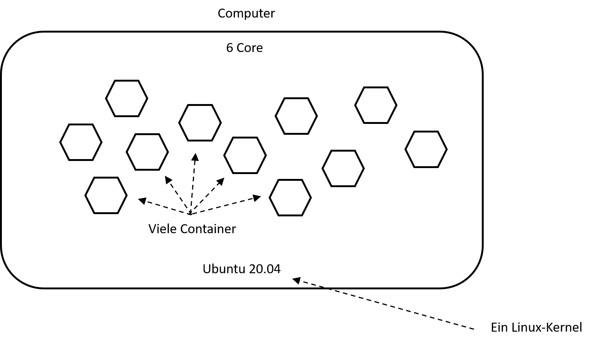
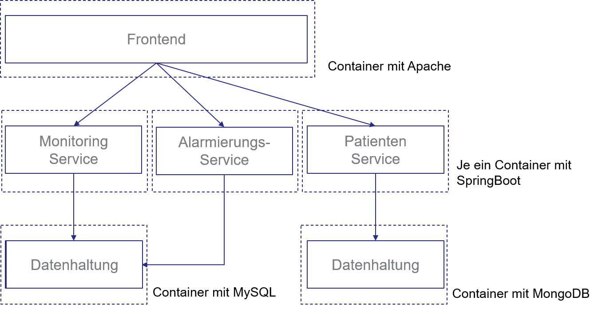
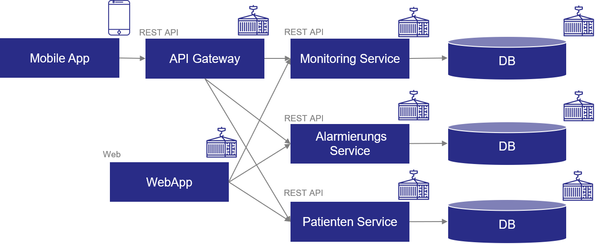
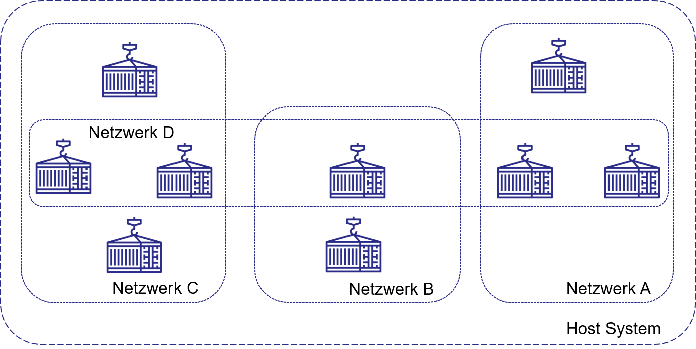
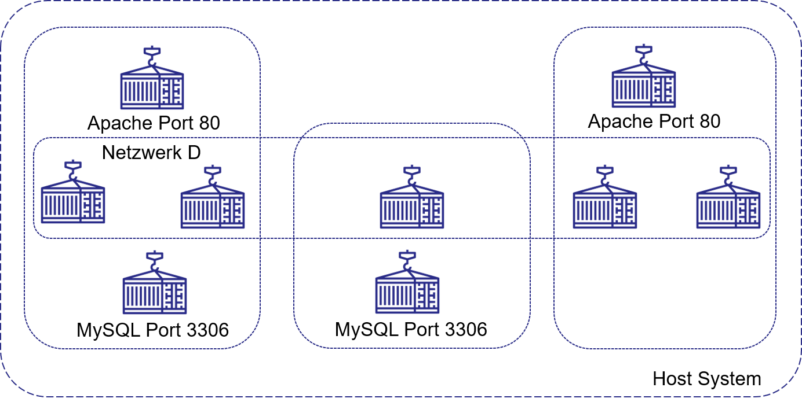
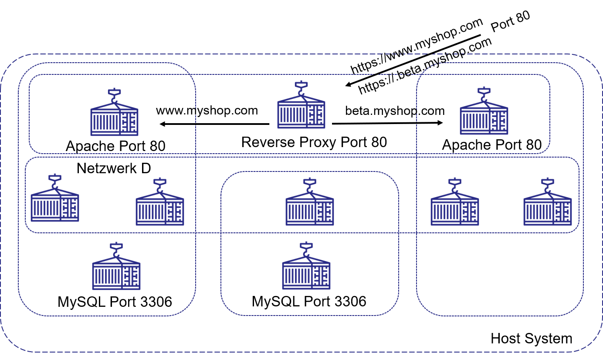
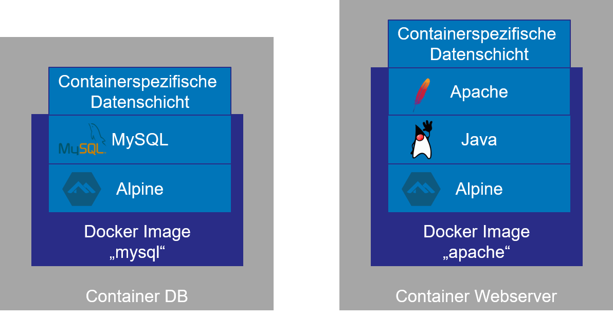
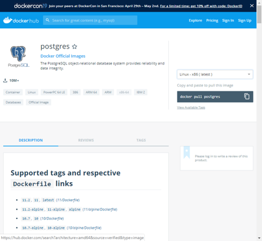

<!--

author:   Andreas Heil

email:    andreas.heil@hs-heilbronn.de

version:  0.1

language: de

narrator: DE German Male

tags: devops, lecture, container, docker, postman

comment:  

-->

# DevOps - Container

<!-- data-type="none" -->
| Parameter | Kursinformationen |
| --- | --- |
| **Veranstaltung:** | `262062 DevOps`|
| **Semester** | `SEB4` |
| **Hochschule:** | `Hochschule Heilbronn` |
| **Inhalte:** | `Container ` |
| Startseite | [https://liascript.github.io/course/?https://raw.githubusercontent.com/aheil/devops/master/README.md#1](https://liascript.github.io/course/?https://raw.githubusercontent.com/aheil/devops/master/README.md#1) | 
| **Link auf den GitHub:** | [https://github.com/aheil/devops/blob/main/lectures/02_container.md](https://github.com/aheil/devops/blob/main/lectures/02_container.md) |
| **Autoren** | @author |

## Ziele und Kompetenzen

- Vorteile von Virtualisierung und Containern verstehen
- Möglichkeiten der Containerisierung kennen lernen


## Container Motivation  

**Die Idee hinter Containern**

Es gibt verschiedene Möglichkeiten umfangreiche Anwendungen zu installieren. Wir betrachten hier einige Möglichkeiten eine solche Anwendung zu installieren.

{{1}}
************************************

**Intuitives Vorgehen**

- Alle Dienste, Server-Komponenten und Datenbanken werden auf einer Maschine installieren 

- Vorteile:

  - einfach Installation
  - einfache Kommunikation unter den Diensten
  - zunächst einfache Verwaltung und Wartung, da nur ein System verwaltet wird

- Nachteile: 

  - Über die Zeit immer schwerer wartbar, da Änderungen am System nur noch schwer nachvollziehbar bzw. reproduzierbar sind 

************************************

{{2}}
************************************

**Fortgeschrittenes Modell**

- Alle Dienste, Server-Komponenten und Datenbanken werden auf unterschiedlichen Servern installiert

- Hier benötigt man unter Umständen sehr viel Hardware, die am Ende des Tages nicht ausgelastet wird

- **Lösung:** Alle Dienste, Server-Komponenten und Datenbanken werden in **virtuellen Maschinen** (VM) installiert. 

- Konkret würde dies z.B. bedeuten: 

  - eine virtuelle Maschine für die Datenbank#
  - eine virtuelle Maschine für das Backend
  - eine virtuelle Maschine für den Web Server
  - eine virtuelle Maschine für das Monitoring 

- Vorteile:

  - Die VMs sind voneinander unabhängig
  - Ein Problem in einer virtuellen Maschine beeinflusst nicht die anderen Maschinen 

- Nachteile:

  - Es müssen (sehr) viele (virtuelle) Maschinen gewartet und überwacht werden (Betriebssystem und Software-Update)

  - Erhöhter Ressourcenverbrauch, da virtuelle Maschinen exklusiv Hardware in Anspruch nehmen

************************************

{{3}}
************************************

Wie funktioniert eine virtuelle Maschine?

- Eine virtuelle Maschine simuliert eine vollständige Hardware, auf der ein vollwertiges Betriebssystem installiert wird

- Einer solche virtuelle Maschine werden dedizierte Ressourcen zugewiesen

  - CPU bzw. Kerne
  - Hauptspeicher
  - Festplattenplatz 

- **Probleme**: 

  - Die Ressourcen stehen weder dem Host-System, noch den anderen virtuellen Maschinen zur Verfügung 

  - Die virtuelle Maschine bringt ihren ganz eigenen Hardware Abstraction Layer und simuliert die ganze Hardware 

 <!-- style="width: 75%;" -->

************************************

{{4}}
************************************
**Container Modell**

- Dienste, Server-Komponenten und Datenbanken werden in kleinen, isolierten Einheiten (aka Containern) betrieben

- Konkret würde dies z.B. bedeuten: 

  - eine virtuelle Maschine für die Datenbank#
  - eine virtuelle Maschine für das Backend
  - eine virtuelle Maschine für den Web Server
  - eine virtuelle Maschine für das Monitoring 

z.B.

  * Container für Front-End 
  * Je ein Container pro Service
  * Je ein Container pro Datenbank 

* Vorteile

  * Leichtgewichtig
  * Unabhängig 
  * Konfigurierbar 

* Nachteile

  * Stichwort Kubernetes

 <!-- style="width: 75%;" -->

************************************

## Container Grundlagen

**Wie funktionieren Container?**

* Private Sichten (Container) bilden isolierte User-Space-Instanzen für verschiedene Anwendungen
* Hardware-Virtualisierung, Isolation und API (Betriebssystem-Kernel, vgl. Betriebssysteme aus SEB2) werden kontrolliert
* Keine Virtualisierung des Betriebssystems, sondern eine Art der »User-Space-Virtualisierung« auf Basis von Kernel Features.

{{1}}
************************************
**Was ist ein Container von Julia Evans**

<!-- style="width: 75%;" -->

(© by Julia Evans, Zine used with pending permissions)

************************************

{{2}}
************************************
**Beispiel einer Software in Containern**

<!-- style="width: 75%;" -->

************************************

{{3}}
************************************
**Automatisierung mit Containern**

- Mit Container-Technologie lässt sich sehr viel (alles) automatisieren
- Stichwort: GitLab CI/CD (später mehr dazu) 
- Stichwort: Infrastructure as Code (IaS)
- Werkzeuge: Ansible, Salt, Puppet, Vagrant, GitLab CI/CD, GitHub Actions... 

************************************

{{4}}
************************************

**Container können...**

- Unabhängig voneinander gewartet und aktualisiert werden 
- Können in unterschiedlichen Versionen betrieben werden
- Beeinflussen sich nicht gegenseitig

************************************

{{5}}
************************************
**Container 101**

- Container enthalten eine Software und alle Abhängigkeiten
- Gestartet wird ein Container aus einem Abbild (engl. image)
- Container verhalten sich auf allen Maschinen gleich (Entwickler-Maschine, Server, Cloud-Anbieter,...)
- Für die Software sieht der Container aus wie eine eigene Maschine
- Die Software weiß nicht, dass sie in einem Container steckt
- Wird ein Container gelöscht, werden keine Konfigurationsreste auf dem Host / dem Betriebssystem hinterlassen

> Daumenregel: Ein Dienst pro Container

************************************

## Möglichkeiten mit Containern

{{1}}
************************************

**Beispiel Microservices**

Alles auf einer Maschine oder jeder Dienst in einem eigenen Container?

- Container können über verschiedene Maschinen verteilt werden

<!-- style="width: 75%;" -->

************************************

{{2}}
************************************

**Container und Netzwerke**

Container können über eigene Netzwerke miteinander kommunizieren

<!-- style="width: 75%;" -->

************************************

{{3}}
************************************

**Nutzung von Standard-Ports in Containern**

<!-- style="width: 75%;" -->

************************************

{{4}}
************************************

**Reverse Proxy**

Ein Reverse Proxy löst dabei so manche Probleme einzelner Maschinen...

<!-- style="width: 75%;" -->


************************************


## Container Umgebungen  

<!-- style="width: 75%;" -->


## Docker Compose 

Um mehrere Container zu orchestrieren kann `Compose`genutzt werden:

```bash
version: '3'
services:  my_db:
    image: postgres:9-alpine
    environment:
      POSTGRES_DB: mydb
      POSTGRES_PASSWORD: topsecret
      POSTGRES_USER: user1
volumes:
  - db-data:/var/lib/postgresql/data
restart: always
networks:
  - my_network
```

{{1}}
************************************

* Eine Konfigurationsdatei: `docker-compose.yml`
* Container werden mit `docker-compose up` gestartet 
* Container werden mit `docker-compose down` gestoppt

************************************

{{2}}
************************************

**Vorsicht bei fertigen Images **

* Am Beispiel des *postgres*-Images
* Was steckt in dem Image?
* Wirklich nur die Datenbank? 
* Vielleicht ein BitCoin Miner?
* Vielleicht ein SpamBot?
* Vielleicht ein Skript das alles DB-Einträge an jemanden übermittelt?

<!-- style="width: 75%;" -->


************************************

## Image erstellen

Wie bekommt man Software in einen Container?

- Docker installieren (Linux, Windows, macOS)
  - Variante 2: Eigenes Image »bauen«, Container starten 

```bash 
FROM alpine
RUN apk --no-cache add inotify-tools jq openssl util-linux bash
COPY dumpcerts.sh /dumpcerts.sh
RUN chmod +x /dumpcerts.sh
COPY entrypoint.sh /entrypoint.sh
ENTRYPOINT [ "/entrypoint.sh" ]
```
- In einem File, z.B. `Dockerfile`

---

Referenzen 

[1] c't wissen Docker DOCKER – Komplexe Software einfach einrichten, Heise Medien GmbH, 2019

[2] Offizielle Docker Dokumentation: https://docs.docker.com/ 