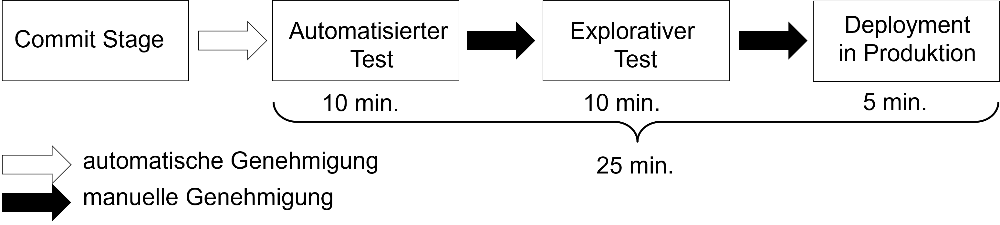

<!--

author:   Andreas Heil

email:    andreas.heil@hs-heilbronn.de

version:  0.1

language: de

narrator: DE German Male

tags: devops, vorlesung, philosophie
comment:  

-->

# DevOps - Philosophie

<!-- data-type="none" -->
| Parameter | Kursinformationen |
| --- | --- |
| **Veranstaltung:** | `262062 DevOps`|
| **Semester** | `SEB4` |
| **Hochschule:** | `Hochschule Heilbronn` |
| **Inhalte:** | `Container ` |
| Startseite | [https://liascript.github.io/course/?https://raw.githubusercontent.com/aheil/devops/master/README.md#1](https://liascript.github.io/course/?https://raw.githubusercontent.com/aheil/devops/master/README.md#1) | 
| **Link auf den GitHub:** | [https://github.com/aheil/devops/blob/main/lectures/03_philosophie.md](https://github.com/aheil/devops/blob/main/lectures/03_philosopie.md) |
| **Autoren** | @author |

## Motivation

### Lernziele

- **Verstehen** worin die Probleme in der klassischen Trennung zwischen Entwicklung und Betrieb liegen.

- Den zentralen chronischen Konflikt als auch die damit in Zusammenhang stehende Abwärtsspirale hinsichtlich von Firmenzielen **verstehen**. 

### Wozu DevOps?

{{1}}
************************************

**Was wissen wir über DevOps?**

- [( )] DevOps funktioniert nur für StartUps
- [( )] DevOps ersetzt Agile 
- [( )] DevOps ist nicht kompatibel zu ITIL
- [( )] DevOps funktioniert nicht mit Security und Compliance
- [( )] DevOps macht den IT Betrieb überflüssig
- [( )] DevOps ist nur Automatisierung
- [( )] DevOps geht nur mit Open Source Software
- [( )] DevOps ist ein Tool

************************************

{{2}}
************************************

**Wozu DevOps?**

Die Frage lässt sich mit einem Blick auf die Evolution von Entwicklung und Deployment von Features in IT-Produkten und Dienstleistungen in den vergangenen 40 Jahren erklären: 

<!-- data-type="none"  -->
| Was | früher | heute |
|---|---|---|
|Kosten| 2.000.000-3.000.000 € | 1.000-100.000 €|
|Entwicklungszeit| 1-5 Jahre| ca. 2 Wochen|
|Deployment-Zeit| Wochen - 2-3 Monate | Wochen - 2-3 Monate | 

************************************

{{3}}
************************************

**Beschleunigter Trend**

<!-- data-type="none"  -->
||1970er bis 1980er|1990er|2000er bis heute|
|---|---|---|---|
|Ära|Mainframes|Client/Server|Commodities u. Cloud|
|Representative Technologien|COBOL, DB2|C++, Oracle, Solaris|Java, MySQL, RedHat, Ruby on Rails, PHP, JS|
|Zyklusdauer|1-5 Jahre|3-12 Monate|2-12 Wochen|
|Kosten| 1.000.000-100.000.000.000 US\$ | 100.000-10.000.000 US\$ | 10.000-1.000.000 US\$ |
|Riskant für|Gesamtes Unternehmen|Produktlinie-/bereich|Produkt-Feature|
|Folgen bei Fehlern|Bankrott, Firmenverkauf, Entlassungen|Umsatzziele verfehlt, C-Level gefeuert|vernachlässigbar|

Quelle 1: Adrian  Cockcroft, Velocity  and  Volume (or  Speed  Wins), Flowcon, November  2013, 2013 

Quelle 2: KEYNOTE: Velocity and Volume (or Speed Wins) by Adrian Cockcroft, https://www.youtube.com/watch?v=wyWI3gLpB8o

************************************

### Konfliktpotential

**Der zentrale chronische Konflikt**

{{1}}
************************************

**Die Abwärtsspirale**

* Instandhalten zentraler, kritischer und meist sehr fragiler Systembestandteile – „… wir räumen das später auf…“

* Die Systeme, die an den ehesten Problemen bereiten... 

  * ...sind unserer wichtigsten Systeme
  * ...sind Ziel der dringlichsten Änderungen  
  * ...schlagen die Änderungen fehl, hat dies massive Auswirkungen auf Kunden, Umsatz, Sicherheit, Finanzen etc.

- Als Konsequenz aus den zuvor genannten Problemen:

  - Es werden neue Features versprochen
  - Der Technologiebereich einer Unternehmung muss diese realisieren
  - Das Versprechen findet statt ohne zu wissen, ob dies technologisch überhaupt möglich ist

- Jetzt gibt es also noch ein neues dringenderes Projekt 

  - Neue Herausforderungen
  - Neue Technologien
  - Mehr technische Schulden – „… wir räumen das später auf…“ 

- Nun sind alle beschäftigt

  - Alles muss am Laufen gehalten werden 
  - Alle haben weniger Zeit und alles dauert etwas länger 
  - Kommunikation dauert etwas länger 
  - Kleine Aktionen haben zu großen Auswirkungen 
  - Liste der Aufgaben wird länger 
  - Alles wird etwas aufwendiger
  - **Der Betrieb hat es immer schwerer stabile IT Services zu liefern**
  - Änderungen sind nicht willkommen 
  - **Die Entwicklung kann nicht mehr auf Änderungen reagieren**

************************************

{{2}}
************************************

**Exkurs: Dringlich vs. Wichtig**

Im Sprachgebrauch werden _dringlich_ und _wichtig_ oft und gerne vermischt… 

Ist das geplante Release _wichtiger_ als die Fehlkonfiguration der Firewall? Was ist _dringlicher_? 

************************************

{{3}}
************************************

**Nicht-technische Konsequenzen**

- Überstunden
- Arbeiten am Wochenende
- Probleme bei Deployments bis hin zu Ausfällen
- Bereitschaften
- Persönliche Heldentaten einzelner Mitarbeiter (Feuerwehreinsätze) Burn-Out 
- Kündigung (der besten Mitarbeiter)
- ...

************************************

## Historie 

### Lernziele 

- Den Ursprung der DevOps Bewegung **kennen lernen** und die »Konvergenz von DevOps« **verstehen**.

### Ursprung

DevOps wurde nicht erfunden, sondern basiert auf

- Lean,
- der Theory of Constraints, 
- dem Toyota Production System,
- dem Resilience Engineering,
- unternehmensweitem Lernen, 
- einer ausgeprägten Sicherheitskultur, 
- zahlreichen menschlichen Aspekten und
- agilen Methoden.

{{1}}
************************************

**Lean Bewegung**

- In den 1980er im Toyota Productive System begründet [1]

  - Value Stream Mapping
  - Kanban-Boards
  - Total Productive Maintenace 
  - Just-in-Time-Konzept 
  - Jidoka und Kaizen (jap.) als zentrale Philosophien

- Grundsätze

  - Durchlaufzeiten als bestes Maß für Kunden- und Mitarbeiterzufriedenheit
  - Kleine Arbeitseinheiten die beste Voraussetzung für kurze Durchlaufzeiten

[1] Toyota Motor Corporation , Toyota Production System, https://global.toyota/en/company/vision-and-philosophy/production-system/

************************************

{{2}}
************************************

**Agile Manifestor**

- 2001 begründet [2]
  - Schlanker Satz von Werten und Prinzipien 
  - Regelmäßige Auslieferungen von Software als Inkremente
  - Kleine bzw. kurze Zeiträume
  - Kleine motivierte Teams
  - Vertrauensbasiertes Management Modell

- Starker Zusammenhang von DevOps und der Agile Community

[2] K. Beck, et al, Agile Manifest, https://agilemanifesto.org/

************************************

{{3}}
************************************

**Agile Infrastructure und Velocity**

- 2008 – Patrick Deboid und Andrew Shafer unterhielten sich über die Anwendung agiler Prinzipien auf Infrastruktur [3]

- 2009 – John Allspaw und Paul Hammond auf O‘Reilly‘s Velocity Konferenz stellen vor, wie Entwicklung (Dev) und Betrieb (Ops) gemeinsame Ziele verfolgt hatten [4], [5]

[3] P. Debois, Agile Infrastructure and Operations: How Infra-gile are You?, Agile 2008 Conference, Toronto, ON, 2008, pp. 202-207, doi: 10.1109/Agile.2008.42.
[4] J. Allspaw, 10+ Deploys Per Day: Dev and Ops Cooperation at Flickr, https://www.slideshare.net/jallspaw/10-deploys-per-day-dev-and-ops-cooperation-at-flickr/ 
[5] 10 Deploys Per Day Dev and Ops Cooperation at Flickr, https://youtu.be/c6tWX48tmAo

************************************

{{4}}
************************************

**Continuous-Delivery-Bewegung**

- Jez Humble und David Farley: Continuous Delivery aus Continuous Build, Test und Integration führten zur Deployment Pipeline [6]

- Code und Infrastruktur immer in einem auslieferbaren Zustand 

- Eingecheckter Code kann immer sicher in Produktivumgebung eingespielt werden 

[6] 

************************************

{{5}}
************************************

**Toyota Kata**

- Mike Rother zeigte, dass die Lean Bewegung den Verbesserungsprozess bisher nicht beachtet

  - Tägliche und ständige Verbesserungen

- Grund für den Erfolg von Toyota aufgrund eines Zyklus von 

  - Definieren gewünschter Zustände
  - Setzen von wöchentlichen Zielen
  - Feedback und ständiger Verbesserung der täglichen Arbeit

************************************

### Zusammenfassung 

- DevOps ist nicht „einfach so entstanden“ und wurde nicht „erfunden“ 
- Zahlreiche Bewegungen „konvergierten“ in eine ähnliche Richtung
- Die Entwicklung von DevOps hat sich über Jahre hingezogen

## Kennzahlen in der Wertekette 

### Lernziele 

- Die drei grundlegenden Metriken bzw. Kennzahlen Durchlaufzeit, Verarbeitungszeit als auch %C/A kennen lernen.

- Probleme langer Deployment Durchläufe verstehen und erkennen können. 

- Den Unterschied zwischen Durchlaufzeiten und Verarbeitungszeit verstehen. 

### Technologie-Wertekette 

Grundlage stellt das sog. **Lean Manufacturing** dar.

- Prinzipien und Theorien 
- Wertekette als „Folge von Aktivitäten, die eine Firma vornimmt, um eine Kundenanforderung zu erfüllen“ [7]
Voraussetzungen für schnelle Durchlaufzeiten: reibungsloser und gleichmäßiger Arbeitsfluss

[7] K. Martin, M. Osterling, Value Stream Mapping: How to Visualize Work and Align Leadership for Organizational Transformation, McGraw Hill, 2013

{{1}}
************************************

**Technologie-Wertekette**

Prozess der ein Geschäftsziel in einen durch Technologie unterstützten Dienst wandelt.

- Begin: Arbeit in der Entwicklung / Backlog aufnehmen
- Entwicklung: Implementierung von Code, Commit in eine Versionsverwaltung, von wo aus, jede Änderung gebaut und mit dem Rest der Anwendung integriert und getestet wird
- Wertschöpfung: Entsteht erst, wenn die Dienste produktiv laufen

Für eine zügige Wertschöpfung... 

- muss die Entwicklung  in einem schnellen Flow liefern
	darf Deployment weder Chaos, Ausfälle noch Probleme verursachen

************************************

{{2}}
************************************

**Durchlaufzeiten**

- Da für den Kunden relevant, sind Durchlaufzeiten meist im Fokus von Prozessoptimierungen
- Verhältnis von Verarbeitungszeit zu Durchlaufzeit ist wichtige Kennzahl für Effizienz
- Kurze Verarbeitungszeiten bedeuten kürzere Wartezeiten 

************************************

{{3}}
************************************

**Klassische Deployment Durchläufe**

- Wochen bis Monate
- Lange Laufzeiten erfordern Heldentaten
- Probleme werden erst spät erkannt
- Oftmals mit manuellem Testen und Bestätigungsprozessen verbunden

************************************

{{4}}
************************************

**Deployment-Durchlaufzeiten**

- Deployment Durchlaufzeiten beginnen mit dem Check-In,
enden mit dem Deployment und 
- sind Teil der Verarbeitungszeit. 

************************************

{{5}}
************************************

**Kurze Deployment-Durchlaufzeiten**

- Entwickler erhalten schnell und fortwährend Feedback zur Arbeit 
- Konsequenz: Schnell und unabhängig 

  - Implementieren
  - Integrieren
  - Validieren 
  - Deployen

- Notwendig

  - Modulare Architektur 
  - Saubere Kapselung 
  - Loose gekoppelte Komponenten

> **Konsequenz**: Fehler bleiben überschaubar, können schnell eingegrenzt werden und verursachen keinen globalen Schaden.

************************************

{{6}}
************************************

**Qualitätsmetrik: Complete and Accurate **

- Complete and Accurate (%C/A) [8]
- % the customer can perform a task without having to CAC 

  - _**C**orrect information that was supplied_
  - _**A**dd missing information that should have been supplied_
  - _**C**larify information provided that should have been clear_

- D.h. wieviel % der Arbeit kann entlang der Wertekette genutzt werden ohne die erhalten Daten korrigieren, ergänzen oder nachfragen zu müssen
- Bei uns: Wieviel der Arbeit kann im nächsten Prozessschritt genutzt werden, ohne diese zu überarbeiten.

[8] M. Osterling, K. Martin, Lean Mindset & Behaviours, AMEChicago2012, 2012, https://www.slideshare.net/KarenMartinGroup/lean-mindsets-behaviors-workshop-ame-chicago-2012 

************************************

{{7}}
************************************

**%C/A am Beispiel **

- Um möglichst schnelle Deployment Durchläufe zu erreichen ist eine hohe %C/A erforderlich

  - Wieviel kann ohne CAC getestet werden
  - Wieviel kann ohne CAC explorativ getestet werden
  - Wie gut kann ohne CAC deployed werden

************************************

