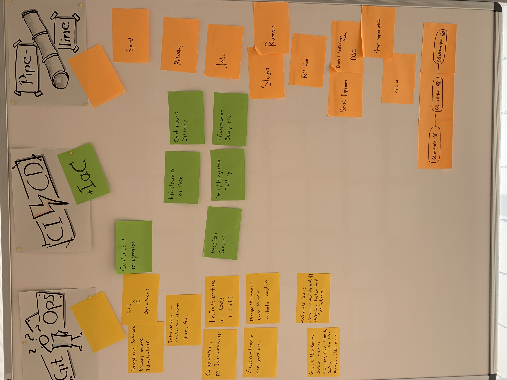

<!--

author:   Andreas Heil

email:    andreas.heil@hs-heilbronn.de

version:  0.1

language: de

narrator: DE German Male

tags: devops, lecture, vorlesung, vagrant, virtualisierung
comment:  

-->

# DevOps - GitOps

<!-- data-type="none" -->
| Parameter | Kursinformationen |
| --- | --- |
| **Veranstaltung:** | `262062 DevOps`|
| **Semester** | `SEB4` |
| **Hochschule:** | `Hochschule Heilbronn` |
| **Inhalte:** | `GitOps` |
| Startseite | [https://liascript.github.io/course/?https://raw.githubusercontent.com/aheil/devops/master/README.md#1](https://liascript.github.io/course/?https://raw.githubusercontent.com/aheil/devops/master/README.md#1) | 
| **Link auf den GitHub:** | [https://github.com/aheil/devops/blob/main/lectures/07_vagrant.md](https://github.com/aheil/devops/blob/main/lectures/08_gitops.md) |
| **Autoren** | @author |

## Ziele und Kompetenzen 

- Grundlagen von GitOPs, CI/CD und Pipelines **erarbeiten** und **verstehen**

## Links zur Veranstaltung

**GitOps**

- GitLab: A beginner's guide to GitOps and how it works:  https://page.gitlab.com/resources-ebook-beginner-guide-gitops.html

- Is GitOps the next big thing in DevOps?: https://www.atlassian.com/git/tutorials/gitops

**CI/CD und IaC**

- What is infrastructure as code (IaC)?: https://learn.microsoft.com/en-us/devops/deliver/what-is-infrastructure-as-code

- DevOps, Infrastructure as Code, and PowerShell DSC:The Introduction: https://powershellmagazine.com/2016/01/05/devops-infrastructure-as-code-and-powershell-dsc-the-introduction/

**Pipelines**

- Using Jenkins - Pipeline: https://www.jenkins.io/doc/book/pipeline/
- What is a DevOps pipeline? A complete guide: https://resources.github.com/devops/pipeline/

### Workshop Ergebnisse WiSe 22

